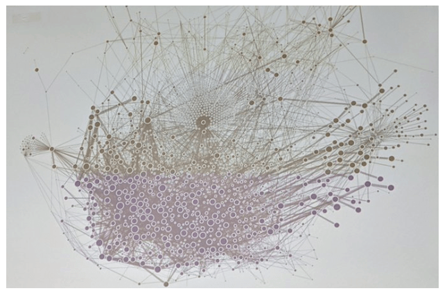

# Microservicios
## Por Rafik Mas'ad Nasra

--- 

<!-- _class: default -->

### Ustedes aprenderán a...

## Diseñar e implementar un sistema en una arquitectura de microservicios.

---

## 🔎 En particular:

- Dividir un sistema y sus datos en pequeños y autónomos servicios.
- Implementar distintos métodos de comunicación entre servicios.
- Construir, desplegar y orquestar múltiples servicios de forma automatizada.
- Control de calidad a aplicaciones en microservicios.
- Implementar interfaces de usuario para una aplicación en microservicios.
- Arquitectura evolutiva en el contexto de microservicios.

---

## 🗃️ Unidades

    Unidad 1: Introducción a microservicios
    Unidad 2: Estrategias de división de servicios
    Unidad 3: Comunicación entre servicios
    Unidad 4: Implementación
    Unidad 5: Interfaz
    Unidad 6: Despliegue (deployment)
    Unidad 7: Control de Calidad
    Unidad 8: Seguridad, resiliencia y escalabilidad
    Unidad 9: Arquitectura evolutiva

---

## 🔧 Para esto tendrán a disposición...

- Estas presentaciones con el resumen de las 9 unidades.
- Material complementario como libros y artículos para profundizar ciertos tópicos. 
- Ejemplos funcionales de cada una de las materias.

---

## Unidad 1
# Introducción a microservicios

---

### Microservicios es un tema popular...

## Y prácticamente todas las grandes (buenas) empresas escriben sus aplicaciones con este patrón arquitectónico


---


---

## ✨ Y se pueden lograr hazañas increíbles

- Nuevas versiones cada 3 segundos.
- Coordinar cientos de servicios en microsegundos
- O seguir operando cuando se cae parte de tu aplicación esta caída





---

<!-- _class: default -->

# Los microservicios son pequeños y autónomos servicios que trabajan en conjunto a los cuales se les accede mediante una red.


---

## 🤏 Son pequeños

- "Mantén junto todo lo que cambia por la misma razón, separa las cosas que cambian por diferentes razones". Single Responsibility Principle de Robert C. Martin.
- "... Tan grande como mi cabeza". James Lewis
- "Algo que pueda ser re-escrito en dos semanas". Jon Eaves
- Ser mantenido por un equipo que pueda ser alimentado por dos pizzas (Two Pizza Rule, Amazon).

Veremos más sobre esto en la **`Unidad 2`**.

---

## 🚀 Son autónomos

Ya que... mantener cientos de servicios dependientes entre si es imposible.

Idealmente... ningún servicio depende de otro para su funcionamiento (mínimamente acoplados). La autonomía es a nivel de lógica y datos.

Lo que implica que... **los micro-servicios deben poder actualizarse y desplegarse independientemente**.

Veremos más sobre esto en la **`Unidad 2`** y la **`Unidad 3`**.

---

## 🤝 Trabajan en conjunto

- En aplicaciones como Amazon, Netflix o Uber, en una sesión de un usuario se usan decenas (a veces cientos) de servicios.
- No es factible que la interfaz interactué con cientos de servicios, por eso se utiliza una puerta de entrada a los otros servicios.
- La comunicación entre los micro-servicios, habitualmente es asíncrona.

Veremos más sobre esto en la **`Unidad 3`**, **`Unidad 4`** y la **`Unidad 5`**.

---

## 🌏 Se les accede mediante una red

- Se utilizan distintos protocolos y tecnologías para comunicarse con un microservicio: _RESTFul_, _gRPC_, _GraphQL_, _AMQP_, etc.
- La comunicación _(casi siempre)_ entre los servicios es mediante la intranet de un _cluster_. Estos servicios están dentro de contenedores (como [Docker]) y se despliegan mediante [Kubernetes].

Veremos más sobre esto en la **`Unidad 2`** y la **`Unidad 6`**.

---

## Un sistema en microservicios tiene ventajas sobre uno monolítico: reutilización de componentes, heterogeneidad de tecnologías, alineamiento organizacional, facilidad de despliegue y escalamiento.

---
<!-- _class: default -->
<!-- _backgroundColor: white -->


---

## Pero también hay desventajas: se requiere una mayor experiencia interna del equipo de desarrollo, sobrecarga de tecnologías, mayores costos de desarrollo y control de calidad, datos disgregados y posiblemente inconsistentes y mayor latencia en las consultas. 

---

## 🥳 Microservicios es recomendable cuando ... 

- La aplicación es suficientemente grande para no lograr ser mantenible.
- La aplicación necesita ser desarrollada por grandes equipos.
- Se tiene varios servicios ya desarrollados.
- Se requiere trabajar con múltiples tecnologías.

---

## 👎 Microservicios **no** son recomendables cuando...

- El sistema aun no define bien el dominio del problema (_startups_).
- Aplicaciones o equipos de desarrollo pequeños.
- Aplicaciones que los usuarios/clientes deben realizar el despliegue. 

---

# La arquitectura de microservicios es la evolución de SOA.

### A principios de los 90' no existían una serie de tecnologías que permiten hoy desarrollar microservicios.

---

## ⛓️ Contenedores

- Es deseado poder aislar los micro-servicios
- Virtualización es un mecanismo habitual para aislar servicios, pero engorroso y excesivo en microservicios
- Los contenedores son versiones más livianas y flexibles de las maquinas virtuales.
- Tecnologías como [Docker] permiten crear contenedores con un archivo con instrucciones (`dockerfile`).

---

## 🧩 Ejemplo de `dockerfile`

```docker
FROM python:3.10

WORKDIR /code

COPY ./app /code/app
COPY ./requirements.txt /code/requirements.txt

RUN pip install --no-cache-dir --upgrade -r /code/requirements.txt


CMD ["uvicorn", "app.main:app", "--host", "0.0.0.0", "--port", "80", "--reload"]
```

---

## 🎻 Orquestación de contenedores

- Se necesita orquestar el despliegue de los multiples microservicios en, potencialmente, multiples maquinas.
- Para realizar esto, habitualmente se utiliza [Kubernetes]. Para el desarrollo, habitualmente se utiliza [docker-compose] o [minikube].
- Tanto [Kubernetes], [docker-compose] y [minikube] utilizan [yaml] para escribir sus archivos de configuración. [yaml] es un lenguaje _human-friendly_ de serialización de datos.

Veremos más sobre esto en la **`Unidad 6`**.

---

## 🧩 Ejemplo de `docker-compose.yaml`


```yaml
services:
  demo_01_service_01:
    build: .
    ports:
      - "5000:80"
    links:
      - demo_01_service_01_mongodb
  demo_01_service_01_mongodb:
    image: mongo:5.0
    volumes:
      - demo_01_service_01_mongodb_container:/data/db
...
```

---

## 📖 Agregación de _logs_

- A medida que la cantidad de servicios aumenta, es más difícil tener trazabilidad en el sistema. Esto puede ser un problema para detectar (y solucionar) errores en el sistema.
- Los sistemas de agregación de _logs_ permiten ver todos los _logs_ de todos los sistemas en el mismo lugar.
- Se complementa con patrones como IDs de correlación: un identificador de la transacción/interacción del usuario.

---

## ☁️ 'La' nube (cloud)

La nube o PAAS (_platform as a service_) facilita (y en muchos casos viabiliza) una arquitectura de microservicios:
- Permite contratar infraestructura bajo demanda (cobro por uso) lo que facilita escalar microservicios.
- Ofrece software como bases de datos o _message brokers_ pre-instalados lo que facilita utilizar diversidad de tecnologías.
- Cluster de Kubernetes administrado por el proveedor lo que facilita la gestión de la infraestructura.

---

## 🧩 Ejemplo: `./demo_01`

- [Docker] y [docker-compose] en funcionamiento.
- APIs en [FastAPI] donde un servicio realiza consulta a otro. Documentación de las APIs en `localhost:$puerto/docs`.
- El problema del n+1 (solución en la **`Unidad 5`**).
- Ejemplos de _logging_ en los servicios.
- Ejemplos de consultas a las dos APIs en [Postman].

---

<!-- _class: default -->

# 📝 Tarea

Crear un par de (nano) servicios mediante [FastAPI], que envíen sus _logs_ mediante [Promtail] a un _log aggregation system_ [Loki] y visualizar dichos _logs_ mediante [Grafana]. Todo debe estar desplegado mediante [docker-compose].

---

## 📚 Material complementario
- Building microservices: Designing fine-grained systems, Sam Newman (2021). O'Reilly. Capitulo 1.
- [State of Microservices 2020, The Software House](https://tsh.io/state-of-microservices-2020-by-tsh.pdf)

[Docker]: https://www.docker.com/
[Kubernetes]: https://kubernetes.io/
[FastAPI]: https://fastapi.tiangolo.com/
[Promtail]: https://grafana.com/docs/loki/latest/clients/promtail/
[Loki]: https://grafana.com/oss/loki/
[Grafana]: https://grafana.com/grafana/
[docker-compose]: https://docs.docker.com/compose/
[minikube]: https://minikube.sigs.k8s.io/
[yaml]: https://yaml.org/
[Postman]: https://www.postman.com/downloads/