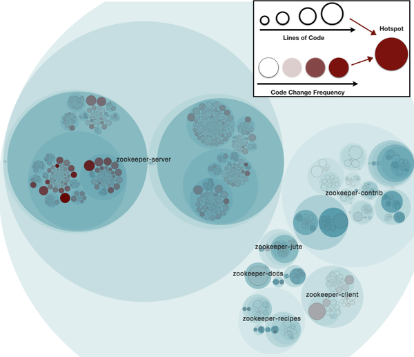
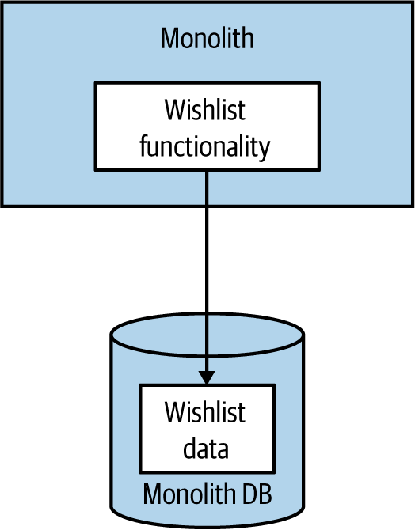
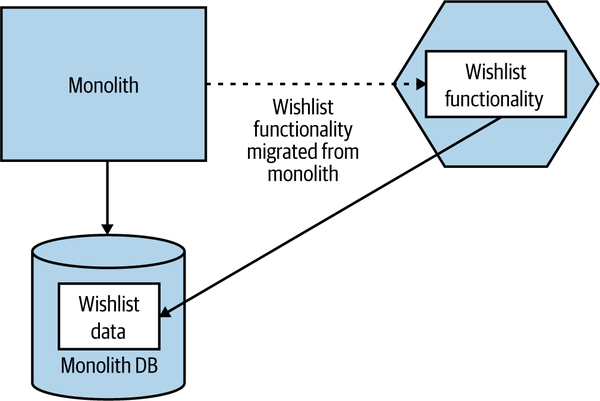
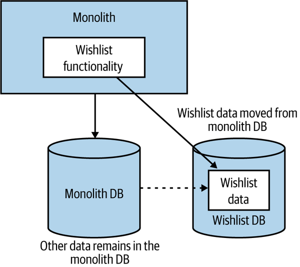
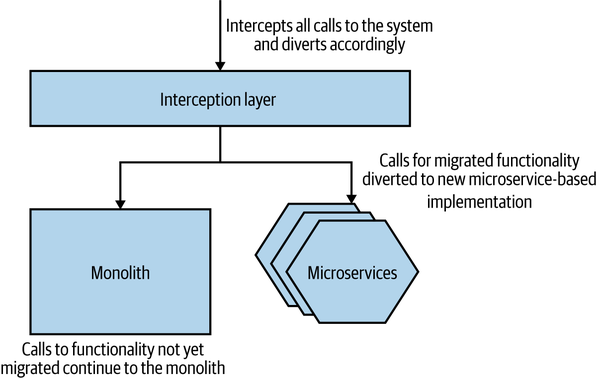
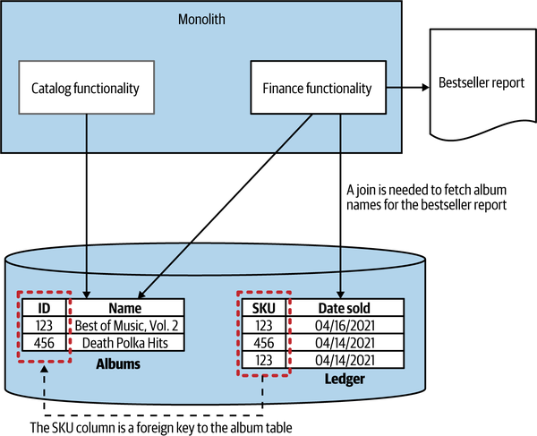
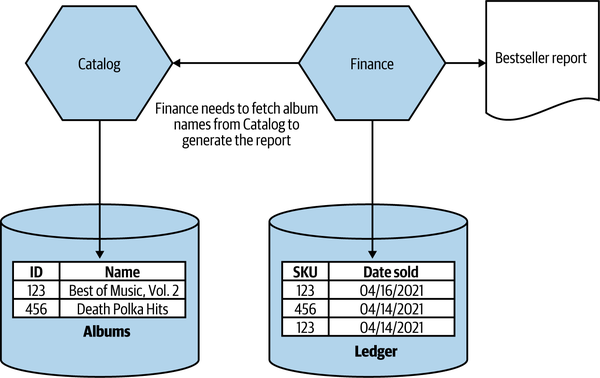
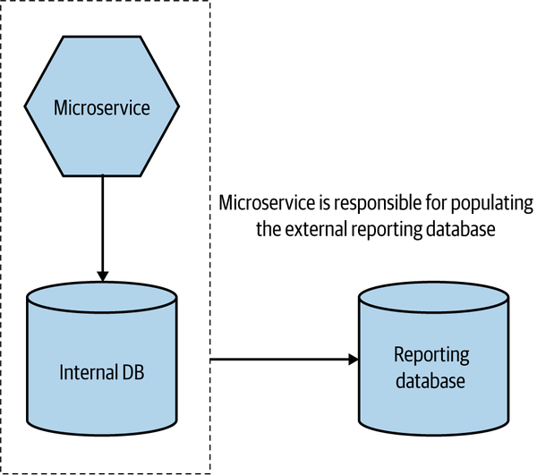

<!-- marp: true -->
<!-- theme: uncover -->
<!-- class: invert -->
<!-- paginate: true -->
<!-- footer: Microservicios por Rafik Mas'ad Nasra -->
<!-- author: Rafik Mas'ad Nasra -->
<!-- title: Introducción a microservicios -->
<!-- size: 16:9 -->

## Unidad 2
# Estrategias de división de servicios

---

### En este capitulo vamos a estar respondiéndonos las preguntas...
## ¿Cómo dividir un servicio de otro? ¿Cómo definir sus fronteras?

---

<!-- _class: default -->

### Parte importante de lo que veremos en este capitulo son técnicas criterios utilizados para dividir módulos. Como microservice es un tipo de arquitectura modular, veremos que gran parte aplica a esta arquitectura. 

<!--
Colyer, en su blog, el 2016 tomo el trabajo de Parnas de 1972, y lo adapto a microservicios.
On the Criteria To Be Used in Decomposing Systems into Modules...
-->

---

**Definir las fronteras de microservicios utilizando los criterios dee [[Parnas, 1972]]:**
- Información oculta
- Cohesión
- Acoplamiento

---

### 🫣 Información oculta

**"La conexión entre los módulos son las suposiciones que deben hacer los módulos entre ellos"** [[Parnas, 1972]]. Hay que reducir la conexión entre los servicios.

---

Esto significa mejor...
- **Velocidad de desarrollo**: se pueden agregar desarrolladores en paralelo.  
- **Comprensión**: se puede entender cada parte sin entender el total.
- **Flexibilidad**: se puede cambiar una parte sin tocar el resto. 

---

### 🫶 Cohesión

"Mantén junto todo lo que cambia por la misma razón..."  (Robert C. Martin)

### 🪢 Acoplamiento

Un servicio no debe requerir que otro servicio cambie para el cambiar.

---

<!-- _class: default -->

Constantine's Law: "Una estructura es estable si tiene alta cohesión y bajo acoplamiento."

<!-- 
- Albert Endres and Dieter Rombach: A Handbook of Software and Systems Engineering. p. 43pp. 2003.
-->

<!--
Fuente: [Why Product Development and Design needs Cohesion-Coupling](https://bootcamp.uxdesign.cc/why-product-development-and-design-needs-cohesion-coupling-87731c84aaa7)
-->

---

## 🕸️ Tipos de acoplamiento

#### Dominio ↔ Paso ↔ Común ↔ Contenido
##### Menos grave ↔ ... ↔ Más grave

---

### 🔨 Acoplamiento de dominio

Esto se da cuando un servicio requiere interactuar con otro servicio para utilizar una funcionalidad que este tiene. Es inevitable en grandes sistemas pero **debe ser minimizada**.

Ejemplo común: se requiere confirmar si el usuario tiene permisos para realizar la acción solicitada: se consulta a un servicio de autentificación. 

---

### 🚏 Acoplamiento de paso

Esto sucede cuando en una llamada de un servicio a otro, se envían datos para que este llame a un tercero.

Un ejemplo es cuando el servicio de compras le envía información adicional al servicio de inventario para que este pueda llamar al servicio de 'delivery' (shipping).

---

### 🗞️ Acoplamiento de datos comunes

Cuando dos servicios comparten el acceso a la misma base de datos pero escriben sobre atributos/entidades distintas. **Debe evitarse a toda costa.**

---

### 💾 Acoplamiento de contenido

Cuando dos servicios comparten el acceso a la misma base de datos y escriben sobre los mismos atributos/entidades.

En caso de error, hace más complejo la trazabilidad de que servicio fue el que realizo el cambio y tiene el problema. **Debe evitarse a toda costa.**

También se le conoce como **acoplamiento patológico**.

---

## 🎨 Domain Driven Design (DDD)

Es una propuesta de Eric Evans (2003) para representar de mejor manera un sistema en el contexto en el que se desenvuelve.

---

### 👔 Lenguaje ubicuo

Definir y adoptar un lenguaje común para el diseño del sistema, el código y el negocio. Tener un lenguaje ubicuo permite ahorrar tiempo y disminuir el roce en la toma de requerimientos.

---

### 🗄️ Agregación

Un conjunto de objetos que son manejados como un sola entidad, habitualmente, refiriéndose a un concepto del mundo real.

Un servicio esta a cargo del ciclo de vida de una o más agregaciones.

---

La relación entre agregaciones dentro del mismo servicio se modelan con una clave foránea.

Cuando la relación es con una agregación de otro servicio, dependencia entre-servicios, se utiliza la ID remota o su URI (_Uniform Resource Identifier_).

---

### 🪢 Contexto acotado

Fronteras explicitas alrededor una parte del dominio del negocio que entrega una funcionalidad al sistema al mismo tiempo que oculta su complejidad. 

Pueden contener una o más agregaciones. Algunas se exponen (_shared models_) y otras se ocultan (_hidden models_).

---

# ✂️ Dividiendo el monolito

---

## 📈 Migración incremental 

"Si haces una reescritura a lo big-bang, lo único de lo que estás garantizado es una gran explosión." (Martin Fowler)

Una estrategia incremental permite limitar el impacto de errores-problemas, ir aprendiendo en el proceso sobre como construir microservicios y permite recibir los beneficios a medida que se vaya construyendo.

---

### 🫂 Coexistencia entre el monolito y los microservicios

Una arquitectura monolítica **no** es intrínsecamente mala. El foco al migrar no es “no tener un monolito”. El foco son los beneficios.

Es común que un monolito coexista con microservicios, a menudo con capacidad disminuida.

---

### ☠️ Peligros de la descomposición prematura

Existe peligro en la implementación de microservicios cuando se tiene una comprensión poco clara del dominio.

---

## 👓 ¿Qué dividir primero?

Se debe comenzar por las partes que más se beneficien de la división, eso depende de los objetivos.

¿Se quiere escalar? ¿Se quiere mejorar el time-to-market? ¿Qué tan viable es separar la funcionalidad?

---

<!-- _class: default -->

Análisis de código con CodeScene de Apache Zookeeper

---

La decisión sobre que dividir es equilibrio entre **lo fácil** que es la extracción y **el beneficio** de extraer. Costo beneficio.

---

## 🥪 Descomposición por capa

Al desacoplar un sistema monolítico, se debe considerar tanto el código (backend) como los datos (base de datos).

---

<!-- _class: default -->

El código y los datos que se desea extraer del monolito.

---

<!-- _class: default -->

### 🤖 Código primero

---

Se extrae el código asociado con la funcionalidad en un nuevo microservicio. Los datos permanecen en la base de datos monolítica en esta etapa.

No hemos completado la descomposición hasta que también hemos movido los datos relacionados con el nuevo microservicio.

Tiende a ser más fácil extraer el código que los datos pero existe el riesgo de postergar la extracción de los datos (y mantener el acoplamiento).

---

<!-- _class: default -->

### 💾 Datos primero 

---

Se extrae los datos de la base de datos asociada con la funcionalidad primero. El código permanece en el monolito en esta etapa.

A pesar de ser una estrategia más compleja, reduce el riesgo de postergar la extracción de los datos.

---

## 💡 Patrones de descomposición

---

### 🌳 Patrón _Strangler Fig_

Envolver un sistema antiguo con el nuevo sistema a lo largo del tiempo, lo que permite que el nuevo sistema se haga progresivamente.

En este contexto, se implementa un servicio intercepta todas las llamadas al sistema. La llamada se redirige a algún microservicio o al monolito, dependiendo de quien la implemente.

---

<!-- _class: default -->

---

### 👀 Correr en paralelo

Al cambiar de arquitectura, en un sistema bien probado a uno nuevo, puede existir preocupación.

Una forma de mitigar esto es ejecutar tanto el monolito como los nuevos microservicios en paralelo, respondiendo las mismas consultas y comparando los resultados.

---

### 🔘 _Feature Toggle_

_Feature Toggle_ es un patrón que permite activar o desactivar una funcionalidad o cambiar entre dos implementaciones de una funcionalidad en tiempo de ejecución.

En este contexto, podemos implementar _feature toggle_ en el _proxy_ para controlar a que usuarios se le entrega que implementación.

---

## 🧐 Preocupaciones al descomponer los datos

### 🏎️ Rendimiento

Las bases de datos son buenas para unir (_join_) datos. 

Al separar los datos en múltiples microservicios, algunas uniones (_joins_) pasan de la base de data (_data tier_) al código de la aplicación (_code tier_). 

---

<!-- _class: default -->

---

<!-- _class: default -->

---

Algunas estrategias para mitigar esto puede ser permitir operaciones _bulk_ por la variable que se va a realizar la unión o algún sistema de cache.

---

### 🤕 Integridad de los datos

Con tablas en diferentes bases de datos, **hay verificaciones que no pueden vivir en el mismo modelo**.

Por ejemplo, no podemos incluir una llave foránea, verificando, antes de borrar una entidad, que no existen entidades relacionadas.

---

No **podemos confiar** en la base de datos para mantener la integridad de los datos.

Existen algunas estrategias que pueden ayudar, cada una con sus costos y beneficios que se deben evaluar en el contexto del proyecto: realizar **_soft delete_** de tablas que sean referenciadas por otros servicios, tener **datos duplicados**, realizar **transacciones entre servicios**, entre otras. 

---

### 💳 Transacciones

Al dividir los datos en múltiples bases de datos, **perdemos la capacidad de realizar transacciones ACID**. Esto lo abordaremos en más detalle en la Unidad 4.

---

### 📝 Base de datos de informes

Al dividir nuestra base de datos también solo permitir a su servicio acceder a dichos datos. Esto permite crear interfaces estables, evitar errores y disminuir problemas de integridad.

Hay casos donde se requiere información de distintos servicios juntas, habitualmente para generar reportes.

---

<!-- _class: default -->

---

Una estrategia es crear una base de datos de informes, que contiene datos de múltiples servicios. Estos pueden poblar esta base de datos directamente o mediante una API REST. Esto se puede hacer en tiempo real o en un proceso _batch_.

Esto permite que otro servicio pueda acceder a los datos de diversos servicios. 

---

## 📚 Material complementario
- Building microservices: Designing fine-grained systems, Sam Newman (2021). O'Reilly. Capitulo 2 y 3.
- On the Criteria To Be Used in Decomposing Systems into Modules, [Parnas, 1972].
- On the criteria to be used in decomposing systems into modules, [Colyer, 2016].
---
- A Handbook of Software and Systems Engineering, Albert Endres and Dieter Rombach (2003).
- Domain-Driven Design: Tackling Complexity in the Heart of Software, Eric Evans (2003). 
- StranglerFigApplication, Martin Fowler (2004). https://martinfowler.com/bliki/StranglerFigApplication.html
- Feature Toggles (aka Feature Flags), Martin Fowler (2017). https://www.martinfowler.com/articles/feature-toggles.html
- Sam Newman, Monolith to Microservices (2019), O’Reilly. 

[Parnas, 1972]: https://www.win.tue.nl/~wstomv/edu/2ip30/references/criteria_for_modularization.pdf
[Colyer, 2016]: https://blog.acolyer.org/2016/09/05/on-the-criteria-to-be-used-in-decomposing-systems-into-modules/