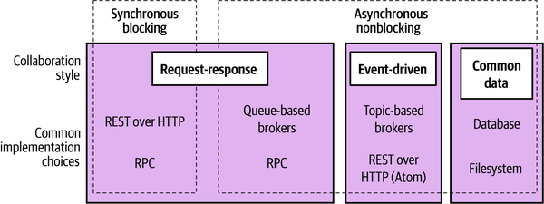
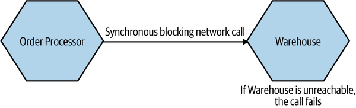
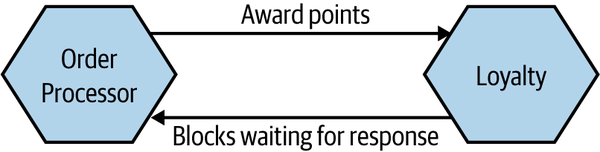
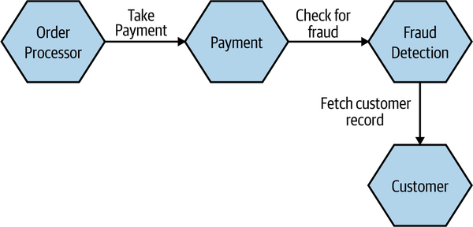
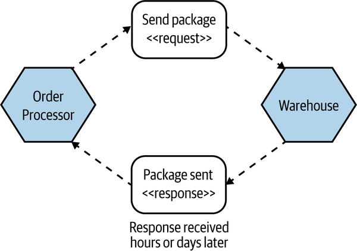
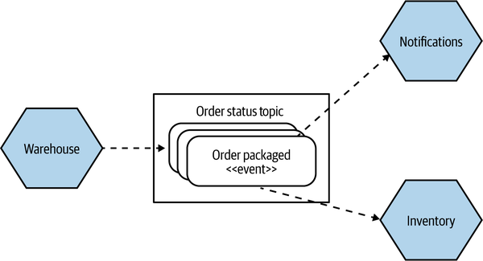
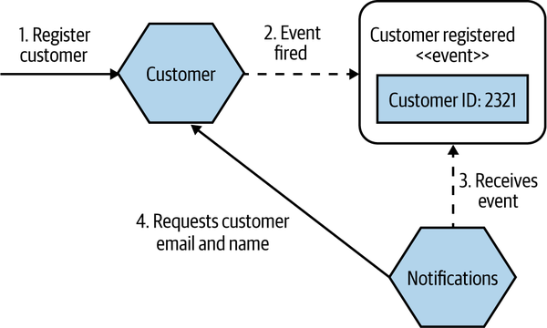
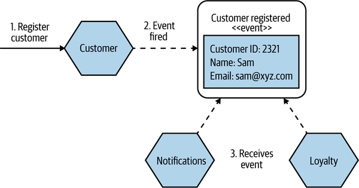

<!-- marp: true -->
<!-- theme: uncover -->
<!-- class: invert -->
<!-- paginate: true -->
<!-- footer: Microservicios por Rafik Mas'ad Nasra -->
<!-- author: Rafik Mas'ad Nasra -->
<!-- title: Introducción a microservicios -->
<!-- size: 16:9 -->

<style>    
    ul { margin: 0; }
    section.invert p { text-align: left; }
    section.invert h4 { text-align: left; }
</style>

## Unidad 3
# Comunicación entre servicios

---

**En este capitulo vamos a revisar distintos mecanismos de comunicación entre servicios, entender las ventajas y desventajas de cada uno, y como seleccionar el que mejor encaja en el problema que estamos tratando de solucionar.**

---

## 📞 De llamadas en un proceso a entre procesos...

Las llamadas a través de una red (entre procesos) son muy diferentes a las llamadas dentro del mismo proceso.

Omitir esta dificultad adicional puede traer multiples problemas.

---

### 📈 Rendimiento

- Las llamadas dentro entre procesos en una red habitualmente se miden en mili-segundos (ms). La latencia es insignificante en las llamadas dentro de un mismo proceso.
- Una función puede llamar a cientos de funciones dentro del mismo proceso, eso no es recomendable en llamadas entre procesos.

---

- Lo mismo pasa con los datos: llamadas dentro de un procesos habitualmente pasan los datos como punteros en la memoria, llamadas entre servicios copian y envían los datos.
- Los datos, al enviarse, requieren ser serializados y deserializados.

---

### 🔌 Cambios en las interfaces

- Cambiar la interfaz de una función dentro de un proceso no es particularmente complejo: están todos en el mismo repositorio de código.
- Cambiar la interfaz entre servicios expone a que otro servicio no se puedan desplegar autónomamente.

---

### 🚨 Manejo de errores

Además de los errores intrínsecos del resultado de llamar a una función, llamadas a otros servicios traen un conjunto adicional de errores. A continuación, alguno de ellos:

---

#### 💥 Falla catastrófica o crash
Todo estuvo bien hasta que el servidor se cayó.¡Reiniciar!


#### 👻 Falla de omisión
Enviaste algo, pero no obtuviste una respuesta. Incluye cuando se envía un evento y este detiene la cola.

---

#### 🕰️ Falla de tiempo
Algo sucedió demasiado tarde (time-out), o ¡sucedió demasiado temprano! (error de carrera).

#### 🫥 Falla de respuesta
Tienes una respuesta, pero parece estar mal. Por ejemplo, faltan valores en la respuesta.

---

#### 🤨 Falla arbitraria (o falla bizantina)
Es cuando algo ha salido mal, pero no sabemos si es hubo error o no (y ¿por qué?).

---

#### ... Internet es un lugar duro, y un sistema distribuido debe considerar estos casos.

---

## 📟 Estilos de comunicación entre servicios

- **Sincrónico con bloqueo**: un microservicio hace una llamada a otro, la operación se bloquea esperando respuesta.
- **Asincrónico sin bloqueo**: el microservicio que emite una llamada puede continuar sin recibir respuesta.

<!-- 
No es necesario elegir un solo estilo de comunicación. Mezclar estilos, potenciando sus ventajas es normal.
-->

---

<!-- _class: default -->



---

<!-- _class: default -->

### ✋ (acoplamiento temporal)

El acople temporal es cuando dos operaciones, de dos microservicios, tienen que pasar al mismo tiempo. 



---

### 🛑 Sincrónico con bloqueo: _request-response_

Un microservicio hace una llamada a otro, la operación se bloquea esperando respuesta.

Esto se da por que algunas operaciones posteriores **requieren la respuesta**, o simplemente porque quiere asegurarse el éxito del trabajo para, si no, realizar un **reintento**.

---

<!-- _class: default -->


---

#### 🧩 Ejemplo de _request-response_ sincrónico

```python
url = f"http://players_service/players?team_id={team_id}"
players = requests.get(url).json()

return [player for player in players
        if player['country'] in countries_in_world_cup]
```

---

#### 🥳 Ventajas de _request-response_ sincrónico

- Es un patrón simple y familiar. Lo hemos utilizado en consultas SQL a bases de datos o llamadas a APIs externas.
- Nos aseguramos de saber la respuesta a la consulta realizada. Podemos asegurar un flujo si existió un error.

---

#### 👎 Desventajas de _request-response_ sincrónico

La principal desventaja de este patrón es que produce acoplamiento temporal:
- Si el microservicio al que se le hace la _request_ no esta disponible, la consulta inicial falla.
- Se requiere esperar la respuesta, esto puede tardar, más aun en consultas a servicios sobrecargados.
- Especialmente problemático cuando se generan cadenas de consultas.


---

<!-- _class: default -->


---

### ⛓️ Asincrónico sin bloqueo: _request-response_

Un microservicio envía una _request_ a otro microservicio solicitando hacer algo. Cuando se completa la operación, ya sea con éxito o no, el microservicio recibe la respuesta.

Esta respuesta puede recibirla cualquier instancia del microservicio.

---

<!-- _class: default -->


---

#### 🧩 Ejemplo de _request-response_ asincrónico

```python
import aiohttp

session = aiohttp.ClientSession()

url = f"http://players_service/players/train?team_id={team_id}"
session.get(url)

return {'working': True}
```

---

#### ⚠️ No siempre async/await es asincrónico

```python
import aiohttp

session = aiohttp.ClientSession()

url = f"http://players_service/players?team_id={team_id}"
players_request = session.get(url)

...

players = await players_request.json()

return [player for player in players
        if player['country'] in countries_in_world_cup]
```

---

#### 🥳 Ventajas de _request-response_ asincrónico

- Al no requerir la respuesta inmediatamente, no hay acoplamiento temporal.
- Se permite respuestas que, por falta de información o alguna regla de negocio, estén en horas o días.

---

#### 👎 Desventajas de _request-response_ asincrónico

- Es más complejo el diseño e implementación de llamadas asincrónicas.
- No hay control del estado de la consulta.

---

### 📨 Asincrónico sin bloqueo: _event-driven_

- Un microservicio emite un **evento** por cada acción que realiza. Ahí termina su responsabilidad.
- El microservicio no sabe que acciones otros microservicios van a realizar al respecto.
- Los microservicios que se suscriben y reciben el evento son los responsables de las respuestas.

---

<!-- _class: default -->


---

#### 🧩 Ejemplo de cliente _event-driven_ con RabbitMQ

```python
channel = ...

channel.exchange_declare(exchange='warehouse'
                         exchange_type='topic')

channel.basic_publish(exchange='warehouse'
                      routing_key='order.2133.packaged',
                      body=json.dump({...}))
```

---

#### 🧩 Ejemplo de servidor _event-driven_ con RabbitMQ

```python
...
queue = channel.queue_declare('notification', exclusive=True)
channel.queue_bind(exchange='warehouse', queue='notification',
                   routing_key='order.*.packaged')

def callback(ch, method, properties, body):
    print(" [x] %r:%r" % (method.routing_key, body))

channel.basic_consume(queue='notification',
                      on_message_callback=callback)
channel.start_consuming()
```

---

- _Event_driven_ intenta ser todo lo contrario a _request-response_: el microservicio que emite el evento sabe muy poco o nada de quienes lo reciben.
- Esto reduce bastante el nivel de acoplamiento de los servicios.
- Esto ayuda bastante a generar equipos independientes trabajando en paralelo.

---

<!-- _class: default -->

#### 📨 (¿eventos o mensajes?)

- Eventos son las acciones que suceden en la plataforma. Es un concepto abstracto, arquitectónico.
- Habitualmente, estos eventos se envían mediante una cola de mensajes. Los mensajes son una forma por la cual se envían los eventos.

---

#### 🆔 Eventos con solo un _id_

- El evento solo envía el _id_ de la entidad modificada.
- Habitualmente esto implica realizar una consulta al microservicio que emitió el evento para obtener más información.
- Aumenta el acoplamiento y genera mayores consultas, lo que implica mayor carga a los servicios.

---

<!-- _class: default -->


---

#### 📖 Eventos con toda la información

- La alternativa es enviar toda la información en el evento.
- Reduce el acoplamiento y al tener un registro de todas las modificaciones del sistema, habilita mayor auditabilidad y patrones como _event sourcing_.
- Eventos muy grandes, dependiendo de la tecnología, mayor a 1 MB, podrían tener problemas.

---

<!-- _class: default -->


---

### 🗄️ Datos comunes

Este patrón se utiliza cuando un microservicio pone datos en una ubicación definida y otros microservicios acceden y la utilizan. Es muy propenso a acoplamiento de datos comunes (🙄).

---


<!-- _class: default -->

# 📝 Tarea

Realiza una presentación simple de tu propuesta de proyecto y su arquitectura. Agrega los mecanismos de comunicación entre servicios a usar y cuales son las conexiones entre los dominios/servicios.

---

## 📚 Material complementario
- Building microservices: Designing fine-grained systems, Sam Newman (2021). O'Reilly. Capitulo 4.
- Distributed Systems: Principles and Paradigms, Andrew S. Tanenbaum (2016)