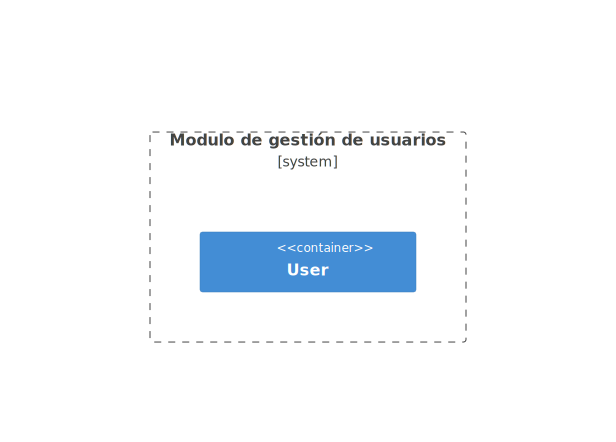
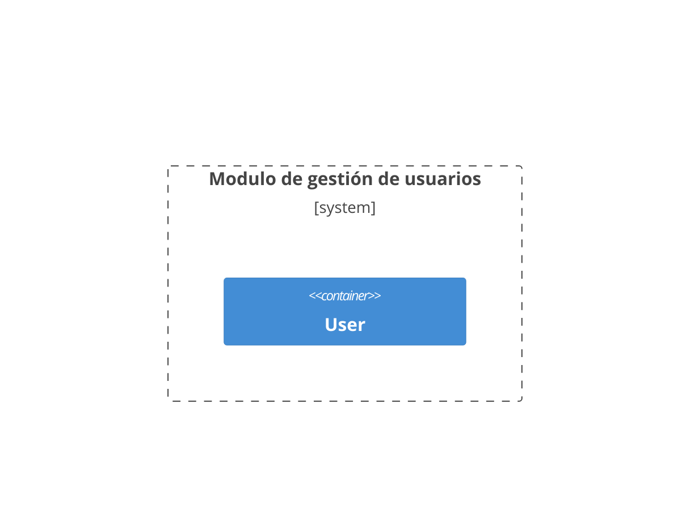
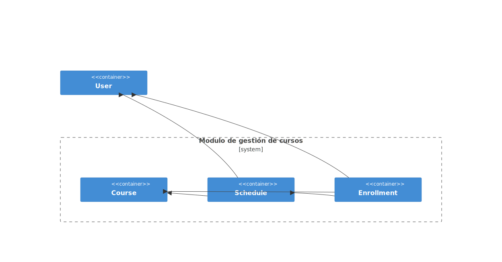
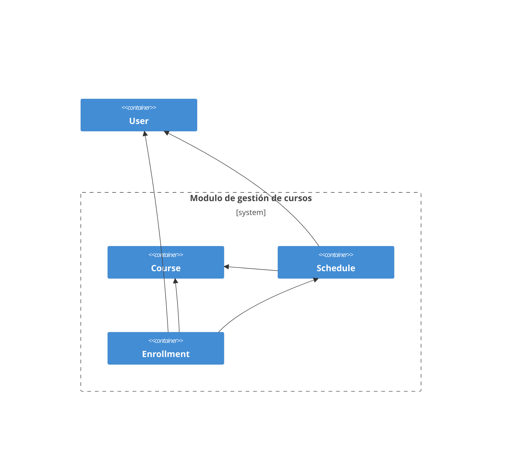
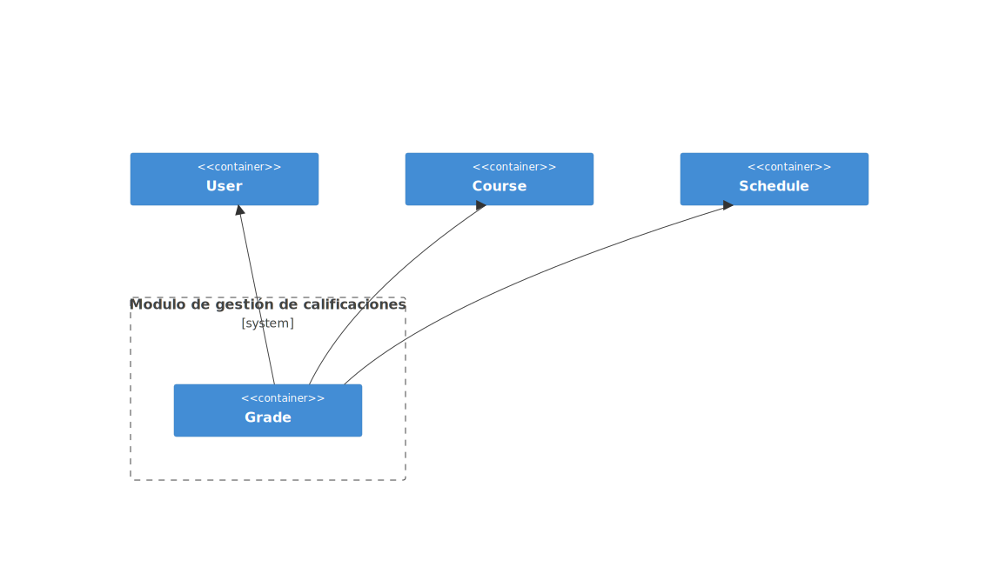
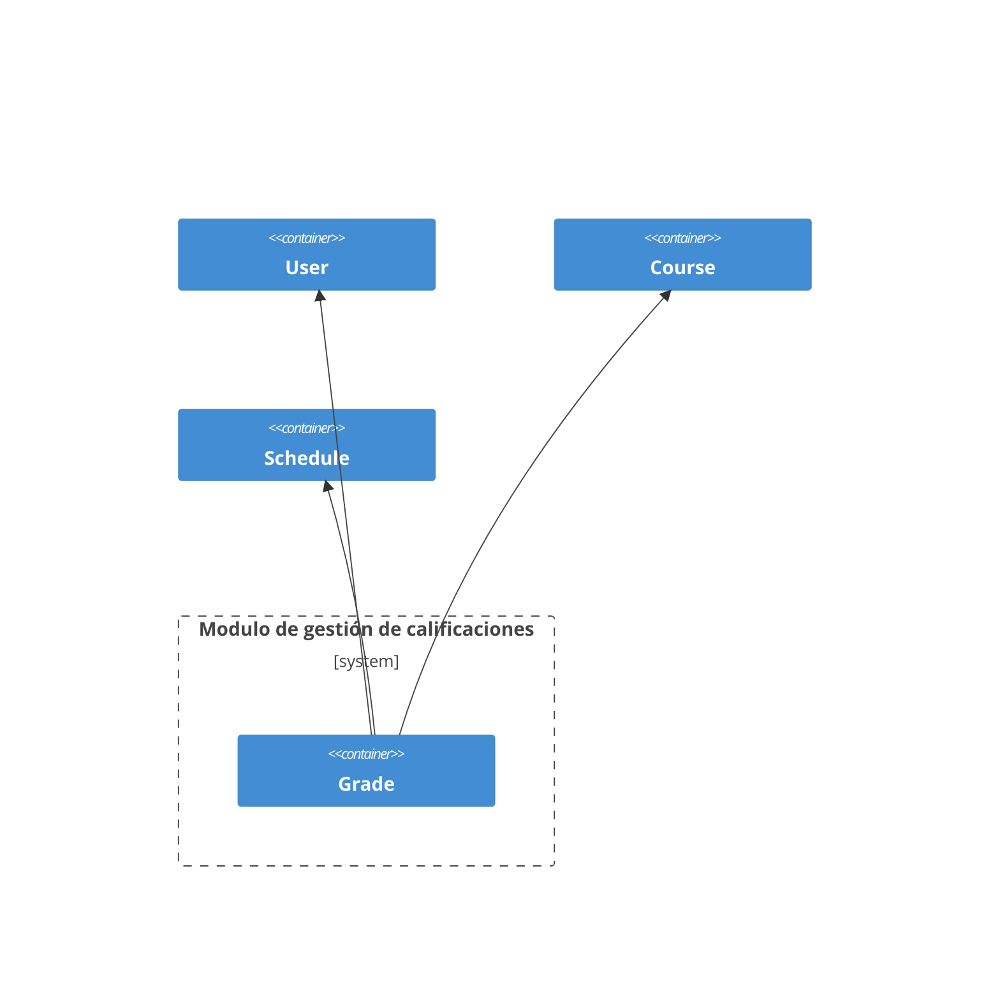
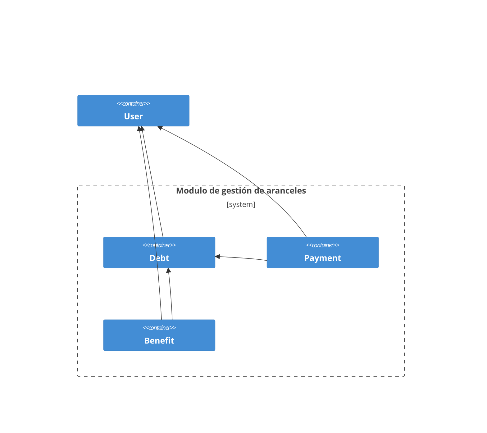
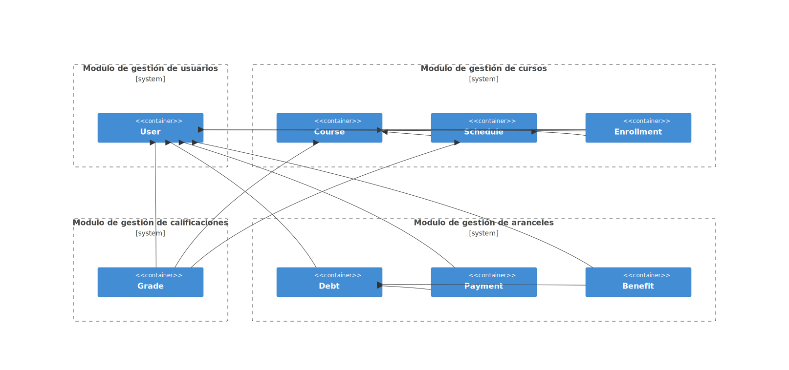
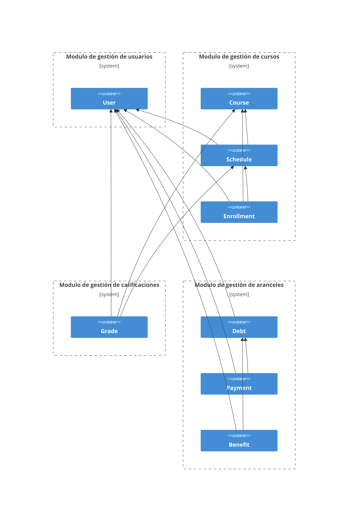

<!-- marp: true -->
<!-- theme: uncover -->
<!-- class: invert -->
<!-- paginate: true -->
<!-- footer: Microservicios por Rafik Mas'ad Nasra -->
<!-- author: Rafik Mas'ad Nasra -->
<!-- title: Comunicación entre servicios -->
<!-- size: 16:9 -->

# Ejemplo de proyecto técnico
## Sistemas de Gestión Académica Universitario

---

### Contexto

Este proyecto técnico está diseñado para gestionar de manera eficiente los sistemas académicos de una universidad. Incluye funcionalidades para la administración de estudiantes, profesores, cursos, inscripción, calificaciones y pago de arancel.

---

Las características clave del sistema incluyen:

- **Gestión de estudiantes, profesores y administrativos**: Registro y seguimiento de la información personal y académica de los miembros de la comunidad universitaria.
- **Gestión de cursos**: Creación y administración de cursos, incluyendo horarios, asignación de profesores e inscripción de estudiantes.
- **Gestión de calificaciones**: Registro y seguimiento de las calificaciones de los estudiantes.

---

- **Gestión de aranceles**: Registro y seguimiento de los aranceles, deuda y pagos de aranceles de los estudiantes.

---

Esta plataforma será construida en microservicios ya que permite una mayor flexibilidad y escalabilidad en el desarrollo y mantenimiento del sistema.

Además, esta plataforma tiene que ser altamente disponible y tolerante a fallos, por lo que la arquitectura de microservicios es la más adecuada para este proyecto.

En periodo de inscripción, la plataforma debe ser capaz de manejar un alto volumen de transacciones simultáneas.

---

## Glosario (lenguaje ubicuo)

- **Estudiante**: Persona que se encuentra inscrita en la universidad.
- **Profesor**: Persona que imparte clases en la universidad.
- **Administrativo**: Persona que trabaja en la universidad en labores administrativas.
- **Curso**: Asignatura que se imparte en la universidad.
--- 
- **Arancel**: Pago que los estudiantes deben realizar para cursar un semestre.
- **Beneficio**: Descuento o ayuda económica otorgada a los estudiantes. Puede ser una beca o un crédito.
- **Calificación**: Nota obtenida por un estudiante en un curso.
- **Deuda**: Monto pendiente de pago por parte de un estudiante.
- **Pago**: Monto abonado por un estudiante para saldar su deuda.

---

## Modulo de gestión de usuarios

---

### Diagrama de arquitectura

---

<!-- _class: default -->

---

---

### Requerimientos

- **Autentificar un usuario**: El sistema debe permitir autentificar un usuario con su correo y contraseña.
- **Autorizar un usuario**: El sistema debe permitir autorizar un usuario para acceder a los recursos del sistema o devolver un error si no tiene permisos.
- **Recuperar contraseña**: El sistema debe permitir recuperar la contraseña de un usuario.
---
- **Cambiar contraseña**: El sistema debe permitir cambiar la contraseña de un usuario.
- **Registrar un nuevo profesor**: El sistema debe permitir registrar un nuevo profesor con su información personal y académica.
- **Actualizar información de un profesor**: El sistema debe permitir actualizar la información de un profesor.
---
- **Eliminar un profesor**: El sistema debe permitir eliminar un profesor. Esta acción debe ser reversible.
- **Consultar información de un profesor**: El sistema debe permitir consultar la información de un profesor.
- **Listar todos los profesores**: El sistema debe permitir listar todos los profesores registrados. Con paginación y filtros.
---
- **Registrar un nuevo estudiante**: El sistema debe permitir registrar un nuevo estudiante con su información personal y académica.
- **Actualizar información de un estudiante**: El sistema debe permitir actualizar la información de un estudiante.
- **Eliminar un estudiante**: El sistema debe permitir eliminar un estudiante. Esta acción debe ser reversible.
---
- **Consultar información de un estudiante**: El sistema debe permitir consultar la información de un estudiante.
- **Listar todos los estudiantes**: El sistema debe permitir listar todos los estudiantes registrados. Con paginación y filtros.
- **Registrar un nuevo administrativo**: El sistema debe permitir registrar un nuevo administrativo con su información personal y laboral.
---
- **Actualizar información de un administrativo**: El sistema debe permitir actualizar la información de un administrativo.
- **Eliminar un administrativo**: El sistema debe permitir eliminar un administrativo. Esta acción debe ser reversible.
---
- **Consultar información de un administrativo**: El sistema debe permitir consultar la información de un administrativo.
- **Listar todos los administrativos**: El sistema debe permitir listar todos los administrativos registrados. Con paginación y filtros.

---

### Listado de puntos de comunicación

Request por API REST:
- **Autentificar un usuario**: `POST /api/v1/auth/login`
- **Autorizar un usuario**: `POST /api/v1/auth/authorize`
---
- **Recuperar contraseña**: `POST /api/v1/auth/recover`
- **Cambiar contraseña**: `POST /api/v1/auth/change-password`
- **Registrar un nuevo profesor**: `POST /api/v1/professors`
- **Actualizar información de un profesor**: `PUT /api/v1/professors/{professor_id}`
---
- **Eliminar un profesor**: `DELETE /api/v1/professors/{professor_id}`
- **Consultar información de un profesor**: `GET /api/v1/professors/{professor_id}`
- **Listar todos los profesores**: `GET /api/v1/professors`
- **Registrar un nuevo estudiante**: `POST /api/v1/students`
---
- **Actualizar información de un estudiante**: `PUT /api/v1/students/{student_id}`
- **Eliminar un estudiante**: `DELETE /api/v1/students/{student_id}`
- **Consultar información de un estudiante**: `GET /api/v1/students/{student_id}`
- **Listar todos los estudiantes**: `GET /api/v1/students`
---
- **Registrar un nuevo administrativo**: `POST /api/v1/administratives`
- **Actualizar información de un administrativo**: `PUT /api/v1/administratives/{administrative_id}`
- **Eliminar un administrativo**: `DELETE /api/v1/administratives/{administrative_id}`
---
- **Consultar información de un administrativo**: `GET /api/v1/administratives/{administrative_id}`
- **Listar todos los administrativos**: `GET /api/v1/administratives`

---

Envío de mensajes (eventos/event-driven):
- **Registro de un nuevo profesor**: `professor.{id}.created`
- **Actualización de información de un profesor**: `professor.{id}.updated`
- **Eliminación de un profesor**: `professor.{id}.deleted`
---
- **Registro de un nuevo estudiante**: `student.{id}.created`
- **Actualización de información de un estudiante**: `student.{id}.updated`
- **Eliminación de un estudiante**: `student.{id}.deleted`
---
- **Registro de un nuevo administrativo**: `administrative.{id}.created`
- **Actualización de información de un administrativo**: `administrative.{id}.updated`
- **Eliminación de un administrativo**: `administrative.{id}.deleted`

---

## Modulo de gestión de cursos

---

### Diagrama de arquitectura

---

<!-- _class: default -->

---

---

### Requerimientos

- **Registrar un nuevo curso**: El sistema debe permitir registrar un nuevo curso con su información académica.
- **Actualizar información de un curso**: El sistema debe permitir actualizar la información de un curso.
- **Eliminar un curso**: El sistema debe permitir eliminar un curso. Esta acción debe ser reversible.
---

- **Consultar información de un curso**: El sistema debe permitir consultar la información de un curso.
- **Listar todos los cursos**: El sistema debe permitir listar todos los cursos registrados. Con paginación y filtros.
- **Crear un paralelo de un curso**: El sistema debe permitir crear un paralelo de un curso.
- **Actualizar información de un paralelo**: El sistema debe permitir actualizar la información de un paralelo.
---
- **Eliminar un paralelo**: El sistema debe permitir eliminar un paralelo. Esta acción debe ser reversible.
- **Consultar información de un paralelo**: El sistema debe permitir consultar la información de un paralelo.
- **Listar todos los paralelos de un curso**: El sistema debe permitir listar todos los paralelos de un curso. Con paginación y filtros.
- **Crear un horario para un paralelo**: El sistema debe permitir crear un horario para un paralelo.
---
- **Actualizar información de un horario**: El sistema debe permitir actualizar la información de un horario.
- **Eliminar un horario**: El sistema debe permitir eliminar un horario. Esta acción debe ser reversible.
- **Consultar información de un horario**: El sistema debe permitir consultar la información de un horario.
- **Listar todos los horarios de un paralelo**: El sistema debe permitir listar todos los horarios de un paralelo. Con paginación y filtros.
---
- **Inscribir un estudiante en un paralelo**: El sistema debe permitir inscribir un estudiante en un paralelo.
- **Actualizar información de una inscripción**: El sistema debe permitir actualizar la información de una inscripción.
- **Eliminar una inscripción**: El sistema debe permitir eliminar una inscripción. Esta acción debe ser reversible.
- **Consultar información de una inscripción**: El sistema debe permitir consultar la información de una inscripción.
---
- **Listar todas las inscripciones de un paralelo**: El sistema debe permitir listar todas las inscripciones de un paralelo. Con paginación y filtros.
- **Seleccionar los estudiantes para un paralelo**: El sistema debe seleccionar los estudiantes que se inscriben en un paralelo de forma aleatoria.
- **Rondas de inscripciones**: El sistema debe permitir realizar rondas de inscripciones para un paralelo.

---

### Listado de puntos de comunicación de cursos

Request por API REST:
- **Registrar un nuevo curso**: `POST /api/v1/courses`
- **Actualizar información de un curso**: `PUT /api/v1/courses/{course_id}`
- **Eliminar un curso**: `DELETE /api/v1/courses/{course_id}`
---
- **Consultar información de un curso**: `GET /api/v1/courses/{course_id}`
- **Listar todos los cursos**: `GET /api/v1/courses`
- **Crear un paralelo de un curso**: `POST /api/v1/courses/{course_id}/parallels`
- **Actualizar información de un paralelo**: `PUT /api/v1/courses/{course_id}/parallels/{parallel_id}`
---
- **Eliminar un paralelo**: `DELETE /api/v1/courses/{course_id}/parallels/{parallel_id}`
- **Consultar información de un paralelo**: `GET /api/v1/courses/{course_id}/parallels/{parallel_id}`
- **Listar todos los paralelos de un curso**: `GET /api/v1/courses/{course_id}/parallels`

---

Mensajes (eventos/event-driven):
- **Registro de un nuevo curso**: `course.{id}.created`
- **Actualización de información de un curso**: `course.{id}.updated`
- **Eliminación de un curso**: `course.{id}.deleted`
---
- **Creación de un paralelo de un curso**: `parallel.{id}.created`
- **Actualización de información de un paralelo**: `parallel.{id}.updated`
- **Eliminación de un paralelo**: `parallel.{id}.deleted`
---

### Listado de puntos de comunicación de horarios

Request por API REST:
- **Crear un horario para un paralelo**: `POST /api/v1/courses/{course_id}/parallels/{parallel_id}/schedules`
- **Actualizar información de un horario**: `PUT /api/v1/courses/{course_id}/parallels/{parallel_id}/schedules/{schedule_id}`
---
- **Eliminar un horario**: `DELETE /api/v1/courses/{course_id}/parallels/{parallel_id}/schedules/{schedule_id}`
- **Consultar información de un horario**: `GET /api/v1/courses/{course_id}/parallels/{parallel_id}/schedules/{schedule_id}`
- **Listar todos los horarios de un paralelo**: `GET /api/v1/courses/{course_id}/parallels/{parallel_id}/schedules`

---

Mensajes (eventos/event-driven):
- **Creación de un horario para un paralelo**: `schedule.{id}.created`
- **Actualización de información de un horario**: `schedule.{id}.updated`
- **Eliminación de un horario**: `schedule.{id}.deleted`

---

### Listado de puntos de comunicación de inscripciones

Request por API REST:
- **Inscribir un estudiante en un paralelo**: `POST /api/v1/courses/{course_id}/parallels/{parallel_id}/enrollments`
- **Actualizar información de una inscripción**: `PUT /api/v1/courses/{course_id}/parallels/{parallel_id}/enrollments/{enrollment_id}`
---
- **Eliminar una inscripción**: `DELETE /api/v1/courses/{course_id}/parallels/{parallel_id}/enrollments/{enrollment_id}`
- **Consultar información de una inscripción**: `GET /api/v1/courses/{course_id}/parallels/{parallel_id}/enrollments/{enrollment_id}`
- **Listar todas las inscripciones de un paralelo**: `GET /api/v1/courses/{course_id}/parallels/{parallel_id}/enrollments`

---

Mensajes (eventos/event-driven):
- **Inscripción de un estudiante en un paralelo**: `enrollment.{id}.created`
- **Actualización de información de una inscripción**: `enrollment.{id}.updated`
- **Eliminación de una inscripción**: `enrollment.{id}.deleted`
- **Selección de estudiantes para un paralelo**: `parallel.{id}.students-selected`

---

## Modulo de gestión de calificaciones

---

### Diagrama de arquitectura
---

<!-- _class: default -->

---

---

### Requerimientos

- **Registrar una calificación**: El sistema debe permitir registrar una calificación para un estudiante en un curso.
- **Actualizar una calificación**: El sistema debe permitir actualizar una calificación.
- **Eliminar una calificación**: El sistema debe permitir eliminar una calificación. Esta acción debe ser reversible.
---

- **Consultar información de una calificación**: El sistema debe permitir consultar la información de una calificación.
- **Listar todas las calificaciones de un estudiante**: El sistema debe permitir listar todas las calificaciones de un estudiante. Con paginación y filtros.
- **Listar todas las calificaciones de un curso**: El sistema debe permitir listar todas las calificaciones de un curso. Con paginación y filtros.
---
- **Listar todas las calificaciones de un paralelo**: El sistema debe permitir listar todas las calificaciones de un paralelo. Con paginación y filtros.

---

### Listado de puntos de comunicación de calificaciones

Request por API REST:
- **Registrar una calificación**: `POST /api/v1/{course_id}/grades`
- **Actualizar una calificación**: `PUT /api/v1/{course_id}/grades/{grade_id}`
---

- **Eliminar una calificación**: `DELETE /api/v1/{course_id}/grades/{grade_id}`
- **Consultar información de una calificación**: `GET /api/v1/{course_id}/grades/{grade_id}`
- **Listar todas las calificaciones de un estudiante**: `GET /api/v1/{student_id}/grades`
---
- **Listar todas las calificaciones de un curso**: `GET /api/v1/{course_id}/grades`
- **Listar todas las calificaciones de un paralelo**: `GET /api/v1/{course_id}/parallels/{parallel_id}/grades`

---

Mensajes (eventos/event-driven):

- **Registro de una calificación**: `grade.{id}.created`
- **Actualización de una calificación**: `grade.{id}.updated`
- **Eliminación de una calificación**: `grade.{id}.deleted`

---

## Modulo de gestión de aranceles

---

### Diagrama de arquitectura

---

<!-- _class: default -->

---

---

### Requerimientos

- **Registrar aranceles**: El sistema debe permitir registrar los aranceles para un estudiante. Esto se debe hacer al inicio de cada año de forma asincrónica.
- **Actualizar información de un arancel**: El sistema debe permitir actualizar la información de un arancel.
- **Eliminar un arancel**: El sistema debe permitir eliminar un arancel. Esta acción debe ser reversible.
---

- **Consultar información de un arancel**: El sistema debe permitir consultar la información de un arancel.
- **Listar todos los aranceles de un estudiante**: El sistema debe permitir listar todos los aranceles de un estudiante. Con paginación y filtros.
- **Registrar matricula**: El sistema debe permitir registrar una matricula para un estudiante. Esto se debe hacer al inicio de cada semestre de forma asincrónica.
---
- **Actualizar información de una matricula**: El sistema debe permitir actualizar la información de una matricula.
- **Eliminar una matricula**: El sistema debe permitir eliminar una matricula. Esta acción debe ser reversible.
- **Consultar información de una matricula**: El sistema debe permitir consultar la información de una matricula.
---
- **Listar todas las matriculas de un estudiante**: El sistema debe permitir listar todas las matriculas de un estudiante. Con paginación y filtros.
- **Registrar un beneficio**: El sistema debe permitir registrar un beneficio para un estudiante. Esto debe marcar como pagado una deuda del estudiante.
- **Actualizar información de un beneficio**: El sistema debe permitir actualizar la información de un beneficio.
---
- **Eliminar un beneficio**: El sistema debe permitir eliminar un beneficio. Esta acción debe ser reversible.
- **Consultar información de un beneficio**: El sistema debe permitir consultar la información de un beneficio.
- **Listar todos los beneficios de un estudiante**: El sistema debe permitir listar todos los beneficios de un estudiante. Con paginación y filtros.
---
- **Registrar un pago**: El sistema debe permitir registrar un pago para un estudiante.
- **Actualizar información de un pago**: El sistema debe permitir actualizar la información de un pago.
- **Eliminar un pago**: El sistema debe permitir eliminar un pago. Esta acción debe ser reversible.
---
- **Consultar información de un pago**: El sistema debe permitir consultar la información de un pago.
- **Listar todos los pagos de un estudiante**: El sistema debe permitir listar todos los pagos de un estudiante. Con paginación y filtros.
- **Listar todos los pagos de un arancel**: El sistema debe permitir listar todos los pagos de un arancel. Con paginación y filtros.
---
- **Consolidado de pagos**: El sistema debe permitir generar un consolidado de los pagos.
- **Consolidado de deudas**: El sistema debe permitir generar un consolidado de las deudas.

---

### Listado de puntos de comunicación de aranceles

Request por API REST:
- **Registrar aranceles**: `POST /api/v1/{student_id}/debts`
- **Actualizar información de un arancel**: `PUT /api/v1/{student_id}/debts/{debt_id}`
- **Eliminar un arancel**: `DELETE /api/v1/{student_id}/debts/{debt_id}`
---

- **Consultar información de un arancel**: `GET /api/v1/{student_id}/debts/{debt_id}`
- **Listar todos los aranceles de un estudiante**: `GET /api/v1/{student_id}/debts`
- **Registrar matricula**: `POST /api/v1/{student_id}/enrollments`
- **Actualizar información de una matricula**: `PUT /api/v1/{student_id}/enrollments/{enrollment_id}`
---

- **Eliminar una matricula**: `DELETE /api/v1/{student_id}/enrollments/{enrollment_id}`
- **Consultar información de una matricula**: `GET /api/v1/{student_id}/enrollments/{enrollment_id}`
- **Listar todas las matriculas de un estudiante**: `GET /api/v1/{student_id}/enrollments`

---

Mensajes (eventos/event-driven):
- **Registro de un arancel**: `debt.{id}.created`
- **Actualización de información de un arancel**: `debt.{id}.updated`
- **Eliminación de un arancel**: `debt.{id}.deleted`
---

### Listado de puntos de comunicación de beneficios

Request por API REST:
- **Registrar un beneficio**: `POST /api/v1/{student_id}/benefits`
- **Actualizar información de un beneficio**: `PUT /api/v1/{student_id}/benefits/{benefit_id}`
- **Eliminar un beneficio**: `DELETE /api/v1/{student_id}/benefits/{benefit_id}`
---

- **Consultar información de un beneficio**: `GET /api/v1/{student_id}/benefits/{benefit_id}`
- **Listar todos los beneficios de un estudiante**: `GET /api/v1/{student_id}/benefits`
- **Registrar un pago mediante un beneficio**: `POST /api/v1/{student_id}/benefits/{benefit_id}/payments`
- **Actualizar información de un pago mediante un beneficio**: `PUT /api/v1/{student_id}/benefits/{benefit_id}/payments/{payment_id}`
---

- **Eliminar un pago mediante un beneficio**: `DELETE /api/v1/{student_id}/benefits/{benefit_id}/payments/{payment_id}`
- **Consultar información de un pago mediante un beneficio**: `GET /api/v1/{student_id}/benefits/{benefit_id}/payments/{payment_id}`
- **Listar todos los pagos de un beneficio**: `GET /api/v1/{student_id}/benefits/{benefit_id}/payments`

---

Mensajes (eventos/event-driven):
- **Registro de un beneficio**: `benefit.{id}.created`
- **Actualización de información de un beneficio**: `benefit.{id}.updated`
- **Eliminación de un beneficio**: `benefit.{id}.deleted`
---
- **Registro de un pago mediante un beneficio**: `payment.{id}.created`
- **Actualización de información de un pago mediante un beneficio**: `payment.{id}.updated`
- **Eliminación de un pago mediante un beneficio**: `payment.{id}.deleted`

---
### Listado de puntos de comunicación de pagos

Request por API REST:
- **Registrar un pago**: `POST /api/v1/{student_id}/payments`
- **Actualizar información de un pago**: `PUT /api/v1/{student_id}/payments/{payment_id}`
- **Eliminar un pago**: `DELETE /api/v1/{student_id}/payments/{payment_id}`
---

- **Consultar información de un pago**: `GET /api/v1/{student_id}/payments/{payment_id}`
- **Listar todos los pagos de un estudiante**: `GET /api/v1/{student_id}/payments`
- **Listar todos los pagos de un arancel**: `GET /api/v1/{student_id}/debts/{debt_id}/payments`
---

Mensajes (eventos/event-driven):
- **Registro de un pago**: `payment.{id}.created`
- **Actualización de información de un pago**: `payment.{id}.updated`
- **Eliminación de un pago**: `payment.{id}.deleted`

---

## Diagrama de arquitectura general

---

<!-- _class: default -->

---

---

# 👏

graph TD;
    A-->B;
    A-->C;
    B-->D;
    C-->D;

