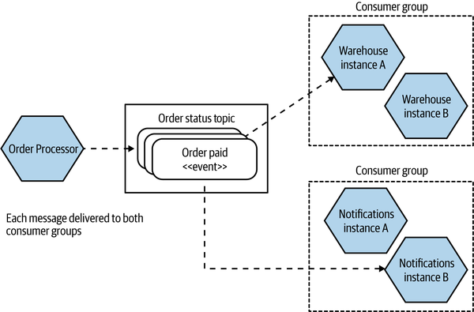
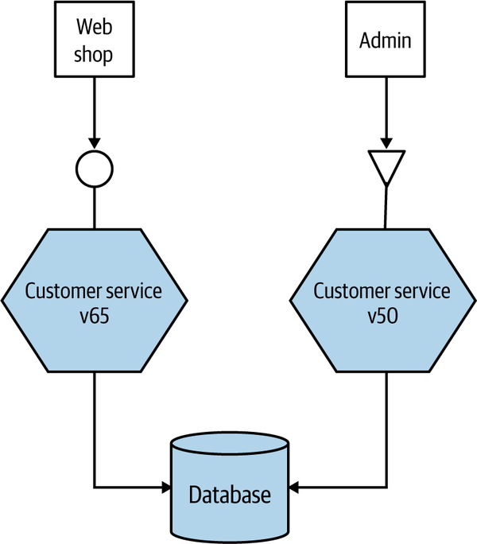
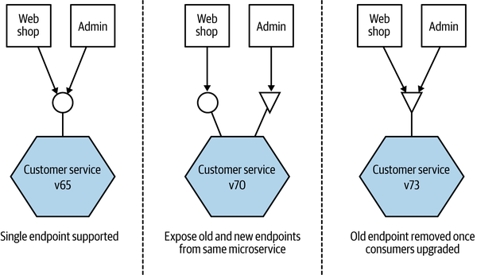
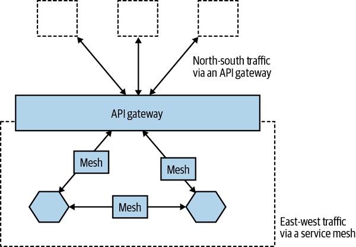
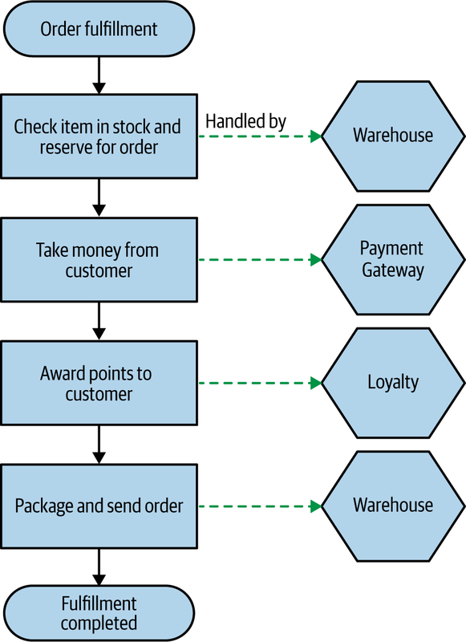
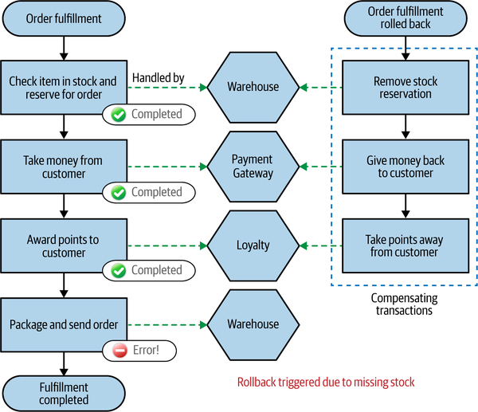
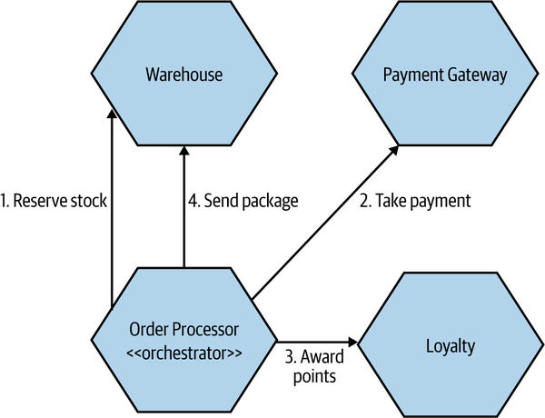
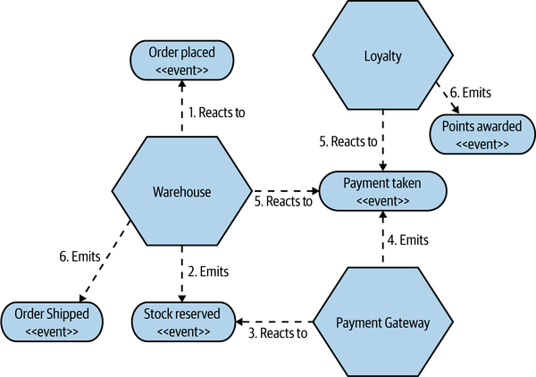

<!-- marp: true -->
<!-- theme: uncover -->
<!-- class: invert -->
<!-- paginate: true -->
<!-- footer: Microservicios por Rafik Mas'ad Nasra -->
<!-- author: Rafik Mas'ad Nasra -->
<!-- title: Introducción a microservicios -->
<!-- size: 16:9 -->

<style>    
    ul { margin: 0; }
    section.invert p { text-align: left; }
    section.invert h4 { text-align: left; }
</style>

## Unidad 4
# Implementación

---

<!-- _class: default -->

## De la unidad de pasada...


#### Estilo ⇝ Patrón ⇝ Tecnología
Ej. Sincrónico con bloqueo ⇝ _request-response_ ⇝ REST

---

## 🤔 Criterios para elegir tecnología

- Facilitar la compatibilidad con versiones anteriores: consumidores que usan versiones antiguas de la API deben seguir funcionando.
- Interfaz explícita:  se debe exponer claramente sus funcionalidades y que hacen, tanto para los desarrolladores como para quienes la consumen.

---

- Simple para los consumidores: buena documentación, intuitivo y compatible con distintas tecnologías.
- Ocultar detalles de implementación interna: más deben saber los consumidores de un servicio, más aumenta el acoplamiento. 

---

## 🖨️ Elección de tecnología

Existen múltiples tecnologías de comunicación entre servicios. Para efectos de este curso, veremos: _Remote Procedure Calls_ (RPC), REST, GraphQL y _Message brokers_.

---
### 📞 _Remote Procedure Calls_ (RPC)

La _Remote Procedure Calls_ (RPC) se refiere a hacer un llamada local y hacer que se ejecute en un servicio remoto. Hay diferentes implementaciones de RPC.

Por lo general, usar una tecnología RPC incluye un protocolo de serialización.

Las implementaciones más conocidas son XML-RPC, SOAP y gRPC.

---

#### 🧩 Ejemplo de servidor RPC

```python
from xmlrpc.server import *

class RequestHandler(SimpleXMLRPCRequestHandler):
    rpc_paths = ('/RPC2',)

server = SimpleXMLRPCServer(('localhost', 8000),
                            requestHandler=RequestHandler)
server.register_introspection_functions()

@server.register_function
def add(x, y):
    return x + y

server.serve_forever()
```

---

#### 🧩 Ejemplo de cliente RPC

```python
import xmlrpc.client

s = xmlrpc.client.ServerProxy('http://localhost:8000')
print(s.add(2,3))  # Returns 5
```

---

#### 👎 Desventajas de RPC

- Acoplamiento tecnológico: algunas implementaciones de RPC, están fuertemente vinculados a un plataforma o lenguaje específico.
- Las llamadas locales no son llamadas remotas: la idea central de RPC es ocultar la complejidad de una llamada remota. Sin embargo, puede ser esconderse demasiado.
- Es frágil: a cambios y extensiones en las funciones del servidor. 

---

### {} REST sobre HTTP

- Representational State Transfer (REST) es un patrón arquitectónico inspirado en la web.
- REST se basa en el concepto de recursos. Un recurso es una entidad que el servicio maneja (como los productos o cliente).
- Habitualmente se representan estos recursos como un JSON.
- Es normal exponer la URI de recursos relacionados.

---

- REST utiliza las capacidades de HTTP, en particular los verbos (GET, POST, PUT y DELETE).
- Hay muchos ejercicios para estandarizar (y documentar mejor) REST, como [OpenAPI].
- Lectura recomendada: [Best Practices for Designing a Pragmatic RESTful API].

🧩 ```demo_01``` de la Unidad 1 es un buen ejemplo de una API REST.

---

#### 👎 Desventajas de REST

- Es más difícil de consumir una API REST que una RPC. Hay una tendencia a crear librerías para estas API (lo cual aumenta el acoplamiento).
- Cuesta encontrar API REST bien documentadas, OpenAPI no es (aun) tan fácil de implementar. Aun así, más propicia a ser bien documentada que RPC.
- Tienen menor rendimiento que RPC.

---

### 🕸️ GraphQL

- Una consulta puede traer (fácilmente) multiples entidades.
- Es el cliente el que determina los datos que requiere del servidor.
- Existen dos tipos de consulta, las _query_ (obtener datos) y las _mutations_ (modificar datos).

Lectura recomendada: [Using GraphQL with Python – A Complete Guide].

---

#### 👎 Desventajas de GraphQL

- Aunque han habido avances significativos, dependes de que GraphQL este implementado en tu lenguaje.
- Es fácil realizar consultas poco optimas.
- Su forma de realizar consultas, similar a SQL, refuerza la idea (equivocada) que los microservicios son _wrapper_ de bases de datos.
- Por ser un método de comunicación nuevo, no todas las tecnologías son compatibles.

---

### 💬 _Message brokers_

- _Message brokers_ son intermediarios (_middleware_), que manejan la comunicación entre procesos (o servicios).
- Son una opción popular para manejar comunicación asíncrona entre servicios.
- Un mensaje es algo que un _message brokers_ manda. Puede contener una consulta, una respuesta o un evento. 

--- 

- Un servicio envía el mensaje al _message brokers_ sin tener conocimiento de que servicios lo recibirán.
- Existen multiples _message brokers_, por ejemplo [RabbitMQ], [Redis] o [Apache Kafka].
- Nubes como Google Cloud, Amazon y Azure proveen sus propios _message brokers_.
- Para efectos de este curso, usaremos como _message brokers_ [RabbitMQ].

---

#### 🔔 Tópicos y colas

- Habitualmente los _message brokers_ implementan sistemas de tópicos, colas o ambos.
- [RabbitMQ] un mensaje es enviado a un tópico (_exchange_), una cola (_queue_) se suscribe a uno o más tópicos.
- Los suscriptores (replicas de un microservicio en nuestro caso) toman cada mensaje de la cola y lo procesan.

---

<!-- _class: default -->


---

#### 🤝 Entrega garantizada

- Los _message brokers_ garantizan que los mensajes son entregados al tópico y a las colas que lo suscriban.
- Si el servicio receptor esta inaccesible, llegara cuando vuelva a estar disponible.
- No se garantiza que el resultado del procesamiento del mensaje haya resultado con éxito. Tampoco se garantiza el orden en que se procesan.

---

## 🔢 Formatos de serialización

- Alguna de las tecnologías que hemos conversado vienen con formatos de serialización.
- En el caso que no, se debe elegir entre formatos textuales (como JSON y XML) o binarios (como Base64).

---

## 📝 Esquema

- En este contexto, es que expone y que acepta en cada _end-point_ un microservicio.
- Varias de las tecnologías que hemos revisado requieren definir esquema. Siendo o no requerido, es recomendable.
- Ayudan a capturar _breaking change_. Hay de dos tipos: estructurales y semánticos. 


---

- Un cambio estructural hace que la forma que se usaba antes el _end-point_ ya no funciona: cambia la cantidad de parámetros requeridos, como se llama o la estructura de lo que devuelve.
- Un cambio semántico es cuando la forma a la que se accede a un _end-point_ se mantiene pero el comportamiento de este cambia. Esto es más peligroso

---

<!-- _class: default -->

#### 🏷️ Versionamiento semántico

# MAYOR.MINOR.PATCH

- Mayor: cambios drásticos no compatibles con versiones anteriores.
- Minor: agregar o extender una funcionalidad. Es compatible con versiones anteriores.
- Patch: corrección de algún error o mejoras menores. Es compatible con versiones anteriores.

---

## 🦘 Evitar los _breaking change_

- Extiende la interfaz (API), no elimines cosas viejas.
- Consume la interfaz pensando en que puede cambiar. Se flexible.
- Usa tecnologías que permitan compatibilidad con cambios.
- Interfaces explicitas en que siempre contiene y que puede cambiar.
- Captura los _breaking change_ accidentales antes que ocurran (pruebas automáticas idealmente).

---

🧩 Ejemplo de errores a evitar

```json

/* Versión original */
{
    "firstname": "Rafik",
    "lastname": "Mas'ad",
    "email": "rmn@nursoft.co",
}

```

---

```json
/* Nueva versión */
{
    "naming": {
        "firstname": "Rafik",
        "lastname": "Mas'ad",
        "nickname": "RMN"
    },
    "number": "+569-1234-567"
}
```

---

Los errores cometidos son:
- No se extiende la interfaz, al agregar dentro de ```naming``` parámetros anteriores ya no es compatible con la versión anterior. 
- Se borra el correo electrónico: si se estaba usando, se rompe el cliente.
- Se agrega el parámetro ```number```, el cual no es explicito (mejor ```phone_number```).

---

## 🚗 Manejar los _breaking change_

Si no es posible evitar los _breaking change_, entonces:
- Que el microservicio que exponga la interfaz y todos los consumidores de esa interfaz cambien al mismo tiempo.
- Ejecuta tanto las versiones antiguas como las nuevas del microservicio.
- Que el microservicio exponga la nueva interfaz y también emule la interfaz anterior.

---

<!-- _class: default -->


Coexistencia de versiones incompatible del microservicio

---

<!-- _class: default -->


Emular la vieja interfaz

---

## 🚦 _Service Meshes_ y _API Gateways_ 

Ambos son _middleware_ (intermediarios) entre un microservicio y sus clientes (que pueden ser otros microservicios).

En la jerga de sistemas, los _services meshes_ se utilizan en el trafico este-oeste (dentro del cluster) y los _API gateways_ en trafico norte-sur (fuera del cluster).

---

<!-- _class: default -->


---

## 🚪 _API Gateway_

En microservicios, su principal preocupación es mapear solicitudes de clientes externos a servicios internos.

Adicionalmente, los _API gateway_ pueden agregar entidades de distintos servicios, implementar sistemas de _logging_, limite de consultas, etc.

Para este curso usaremos GraphQL para implementar los _API gateway_.

---

## 🕸️ _Service Meshes_


Con una _service mesh_, funcionalidades comunes asociadas con la comunicación entre microservicio se implementan en el _mesh_.

Esto reduce las funcionalidades que un microservicio necesita implementar internamente, al tiempo que proporciona consistencia sobre cómo se hacen ciertas cosas.

---

## 📄 Documentación

Documentar cualquier API es caro (y aburrrido). Para minimizar la cantidad de documentación, podemos:

- Crear esquemas tanto de los datos de entrada que requiere un servicio como lo que retorna.
- Sistemas auto-documentables, donde el código y los comentarios sirven de documentación para los clientes de la API.

---

## 🧩 Ejemplo: `./demo_04`

- Dos servicios con API REST con [FastAPI]. Documentación de las APIs en `localhost:{5001-5002}/docs`.
- Comunicación asíncrona entre servicios mediante un _message broker_ [RabbitMQ]. 
- _API Gateway GraphQL_ desarrollado con [ariadne]. Incluye _queries_ y una _mutation_.
- Vinculación entre recursos mediante _bindables_.
- Solución del problema del n+1 con _dataloaders_.

---

## 💳 Transacciones

Una transacción es cuando una o más acciones se tratan como una sola unidad. Esto podría incluir eliminar datos, insertarlos o cambiarlos. En una base de datos relacional, esto podría implicar múltiples tablas actualizadas dentro de una sola transacción.

---

### ♾️ ACID

Cuando hablamos de transacciones en bases de datos, esperamos con que sean atómicas, consistentes, aisladas (isolate) y durables, o ACID como acrónimo.

---

#### ⚛ Atómicas

Asegurarse que todas las operaciones se realicen con éxito o todas falle.

#### ☑️ Consistentes

Cuando se realizan cambios en nuestra base de datos, nos aseguramos de que quede en un estado válido y consistente.

---

#### ⛓ Aisladas

Permite que múltiples transacciones funcionen al mismo tiempo sin interferir entre ellas.

#### 🪨 Durables

Asegura de que una vez que se haya completado una transacción, estamos seguros de que los datos no se perderán en caso de alguna falla del sistema.

---

<!-- _class: default -->

### Una transacción entre microservicios no puede ser atómica y no es trivial que sean aisladas.

---

### 💍 Transacciones distribuidas: compromiso en dos fases

La transacción se divide en dos fases:
- La fase de votación donde se consulta si es posible realizar la transacción.
- Confirmado que se puede realizar la transacción se pasa a la fase de compromiso, donde efectivamente se guardan los datos.

---

De todas formas, al ser transacciones distribuidas, no se puede asegurar que van a pasar al mismo tiempo y, mucho menos, que se van a realizar con éxito.

A veces, se implementa sistemas de _lock_ para asegurarse el aislamiento de la consulta. Esto es pésima idea por que puede producir _deadlocks_.

---

## 🐢 _Sagas_

En 1987, Hector Garcia-Molina y Kenneth Salem definen un modelo para manejar _long lived transactions (LLTs)_ (como las transacciones entre microservicios).

En vez de realizar compromisos en dos fases (o patrones similares), se desglosa la LLTs en etapas de negocio y se realizan pequeñas transacciones.

---

<!-- _class: default -->


---

### 💥 Modos de fallo en una _Saga_

- _Backward recovery_: implica revertir la transacción y limpiar lo realizado. Regresa, o intenta regresar, al punto de inicio de la transacción.

- _Forward recovery_: permite retomar desde el punto en que ocurrió la falla y seguir procesando.

Veremos más sobre sistemas resilientes en la **`Unidad 8`**.

---

<!-- _class: default -->


---

### 🧰 Implementando _Sagas_

Existen dos formas de implementar una _Saga_:

- Orquestación: utiliza un coordinador central (lo que llamaremos a un orquestador) para definir el orden de ejecución y activar cualquier acción requerida.
- Coreografía: se distribuye la responsabilidad del funcionamiento de la saga entre los servicios de colaboración múltiples. 

---

<!-- _class: default -->


---

<!-- _class: default -->


---

<!-- _class: default -->

# 📝 Tarea

Implementa el microservicio asignado para el trabajo final. Para esto debes implementar las operaciones como una API REST y emitir eventos por cada transacción. Debe incluir documentación, esquemas, versionamiento y manejo de errores.

Sube el trabajo al GitLab asignado.

---

## 📚 Material complementario
- Building microservices: Designing fine-grained systems, Sam Newman (2021). O'Reilly. Capitulo 5 y 6.
- Hector Garcia-Molina y Kenneth Salem, "Sagas" ACM Sigmod Record 16, no. 3 (1987): 249–59. 


[OpenAPI]: https://spec.openapis.org/oas/v3.1.0

[Best Practices for Designing a Pragmatic RESTful API]: https://www.vinaysahni.com/best-practices-for-a-pragmatic-restful-api

[Using GraphQL with Python – A Complete Guide]: https://www.apollographql.com/blog/graphql/python/complete-api-guide/

[RabbitMQ]: https://www.rabbitmq.com/

[Redis]: https://redis.io/

[Apache Kafka]: https://kafka.apache.org/

[ariadne]: https://ariadnegraphql.org/docs/bindables

[FastAPI]: https://fastapi.tiangolo.com/