<!-- marp: true -->
<!-- theme: uncover -->
<!-- class: invert -->
<!-- paginate: true -->
<!-- footer: Microservicios por Rafik Mas'ad Nasra -->
<!-- author: Rafik Mas'ad Nasra -->
<!-- title: Introducción a microservicios -->
<!-- size: 16:9 -->

<style>    
    ul { margin: 0; }
    section.invert p { text-align: left; }
    section.invert h4 { text-align: left; }
</style>

## Unidad 5
# Despliegue

---

<!-- _class: default -->

### A diferencia de un monolítico, desplegar una aplicación en microservicio no es algo directo.

---

<!-- _class: default -->

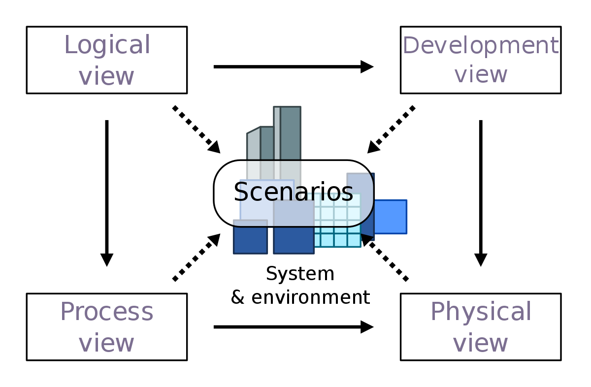

Modelo de arquitectura 4+1 de Kruchten.

---

##  🧰 De la lógica a la física

Una vista lógica de una arquitectura generalmente abstrae las preocupaciones de implementación física subyacente. En este capitulo nos vamos a preocupar también de la vista física de la arquitectura.

---

### 🧬 Multiples instancias

La topología de implementación (vista física) de dos microservicios no es directa.

Tener multiples instancias permite balancear la carga y mejorar la robustez (si falla una instancia, hay otra que puede recibir las consultas).

Para conexiones HTTP, un balanceador de carga basta para manejar el enrutamiento de los servicios.

---

<!-- _class: default -->
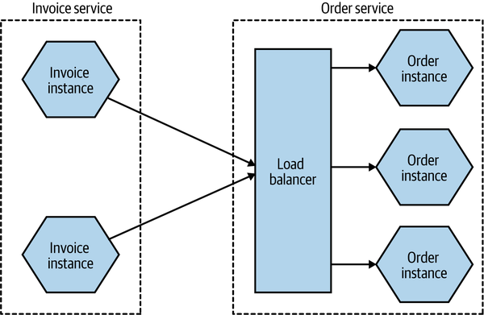

---

La cantidad de replicas va a depende de la aplicación y el uso. Además, por razones de robustez, hay que preocuparse que no todas las instancias estén en el mismo hardware (servidor o incluso datacenter).

---

<!-- _class: default -->
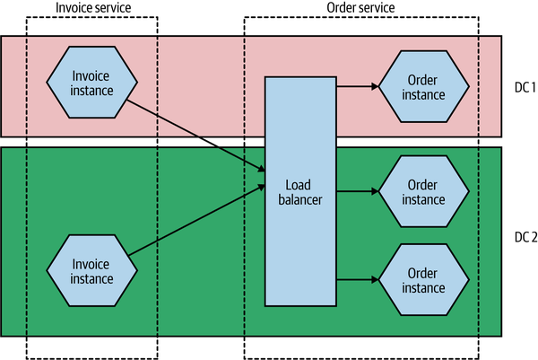

---

### 🗄️ Replica de la base de datos

Como queremos que un microservicio oculte su gestión interna. Esto nos lleva a (siempre) repetir "no compartas base de datos".

Distintas replicas de un servicio **pueden** compartir la misma instancia de una base de datos. Al ser el mismo servicio, la lógica de acceso y manipulación de datos, **siguen dentro del mismo servicio-lógico**.

---

<!-- _class: default -->
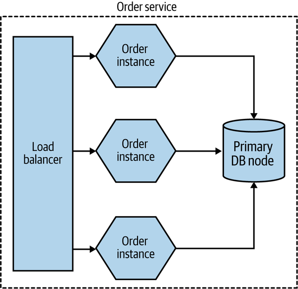

---

#### 📈 Escalar bases de datos 

Existen diversos patrones de implementación de bases de datos replicadas, como tener replicas *read-only*.

---

<!-- _class: default -->
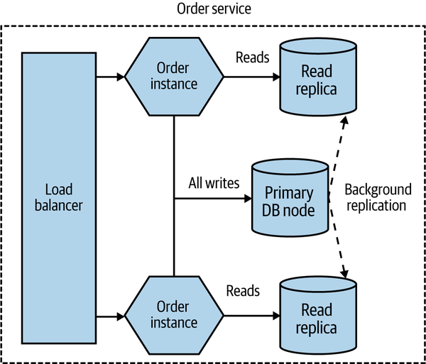

---

Otra decisión habitual es si insolar o no la base de datos en su propia infraestructura. Aunque estén en la misma infraestructura física, siguen siendo bases de datos lógicas distintas.

---

<!-- _class: default -->
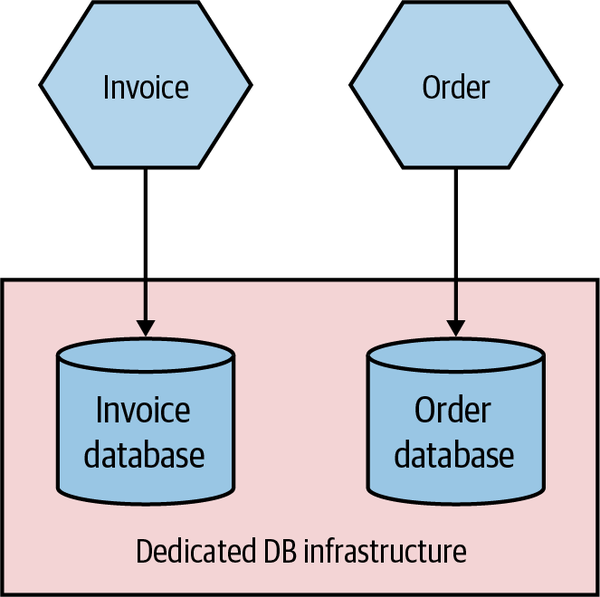

---

<!-- _class: default -->
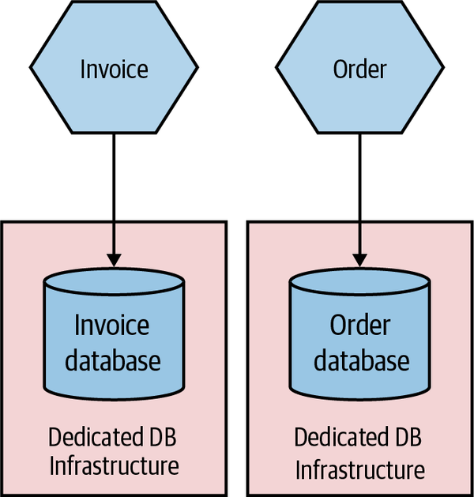

---

### 🌱 Entornos

Cuando despliegas un sistema, corre en un entorno. Distintos entornos pueden servir para distintos propósitos.

Uno puede desplegar la aplicación para realizar desarrollo local, con objetivo de realizar pruebas, como una beta para usuarios, como ambiente productivo, etc.

---

<!-- _class: default -->
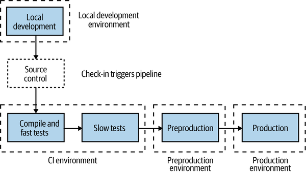

---

<!-- _class: default -->
#### La integración continua (CI) es fundamental para subir versiones más rápido, probar antes y tener feedback temprano. 
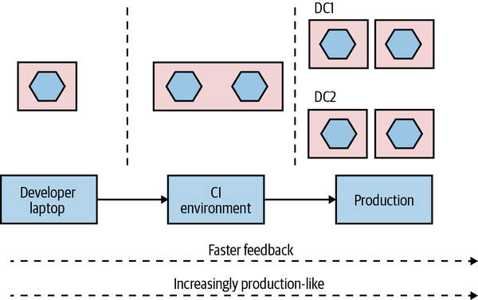

---

<!-- _class: default -->

#### Entonces... Un microservicio puede estar en multiples entornos y el número de replicas de cada uno de estos microservicios puede variar en cada entorno dependiendo de las necesidades.

---

##  📜 Principios del despliegue de microservicios

---

### 🤐 Ejecución aislada 

Cada microservicio debe correr en una maquina (lógica) distinta. Cada servicio puede tener requerimientos distintos (y contradictorios), depender de equipos distintos y/o tener problemas que afecten a la maquina en su conjunto.

El aislamiento puede darse en maquinas (fisicas) distintas, maquinas virtuales o contenedores.

---

<!-- _class: default -->
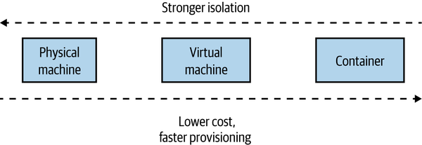

---

### 🤖 Foco en la automatización

A medida que agregas más microservicios, tienes más partes que te tienes que ocupar. En vez de agregar más personas que administren cada microservicio, el foco debe estar puesto en la automatización.

Integración continua, escalamiento automático y migraciones de esquemas en base de datos, son algunos ejemplos de automatización.

---

### 🏛️ Infraestructura como código

La infraestructura como código es llevar conceptos del desarrollo de software al despliegue de sistemas. Al definir la infraestructura mediante código, esta configuración pasa por control de versiones, se prueba y repetirse como parte de un proceso. 

---

### 🕛 Cero tiempo de caída

Implementar sistemas que al ser actualizados no tengan tiempo de caída permite actualizaciones más constantes y, por ende, *feedback* temprano.

---

### 🫥 Gestión del estado deseado

Se especifica a la plataforma los requerimientos para la aplicación, y estos requerimientos se mantienen sin intervención humana. Cualquier problema, el sistema realiza los pasos para devolver el sistema al estado deseado.

Quita presión importante en la revisión y administración del sistema.

---

<!-- _class: default -->
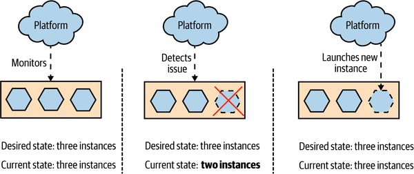

---

## 🤔 Opciones de despliegue

---

### 🖥️ Maquinas físicas

En casos extraordinarios te vas a encontrar desplegando tus microservicios directamente en una maquina física. Sin otra capa de abstracción (contenedores o virtualización).

Esto produce sub-utilización de recursos y, habitualmente, mayor complejidad en el despliegue.

---

### 🦾​ Maquinas virtuales

La virtualización nos permite dividir una maquina física en varias más pequeñas y virtuales. 

Tiene un costo importante el modelo de una maquina virtual por servicio. Además, mantienen parte de los problemas de las maquinas físicas en cuanto a la sub-utilización de recursos.

---

### ⛴️ Contenedores

Los contenedores, popularizados por Docker con el apoyo de Kubernetes como  orquestador, se ha convertido en la opción por defecto para ejecutar microservicio a escala. 

---

<!-- _class: default -->
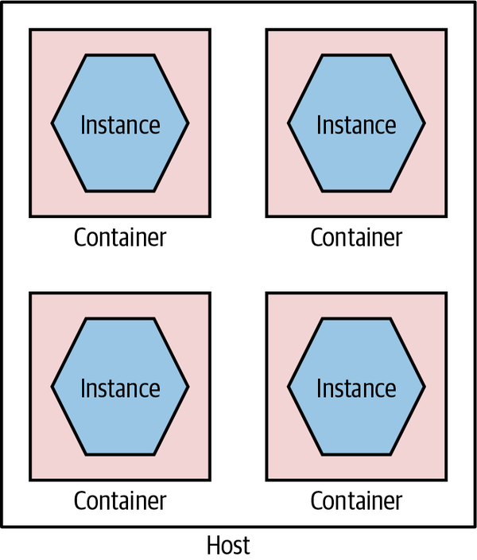

---

<!-- _class: default -->
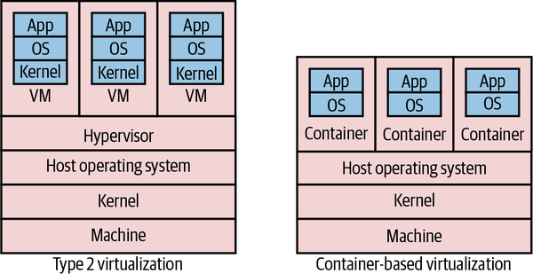

---

### 📦 Contenedores de aplicaciones

Ciertos lenguajes o _frameworks_ tienen sus propias formas de empaquetar el sistema; IIS en .NET o las _Java applications_ son ejemplos de esto.

Puede traer beneficios en reducir el _overhead_ de los contenedores.

---

<!-- _class: default -->
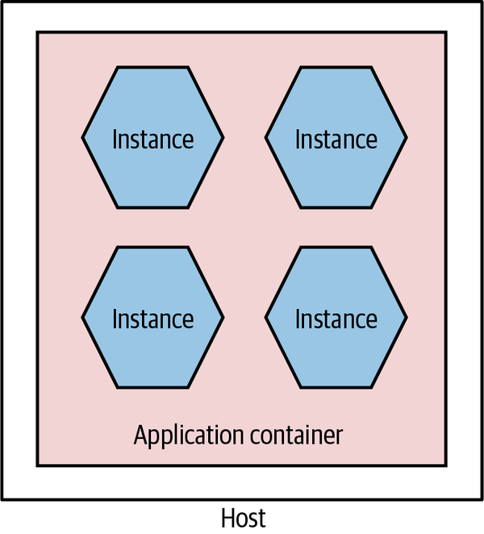

---

Inevitablemente se limita la elección de tecnología. Habitualmente, se ejecutan con sistemas propios de automatización y despliegue.

Algunos contenedores de aplicaciones comparten recursos (memoria, cpu) entre instancias, reduciendo la capacidad de monitorearlos y su aislamiento.

La dependencia de un sistema como la JVM hace que cualquier cambio, implique reiniciar el sistema completo. No están realmente aisladas las instancias.

---

### 🔩 _Platform as a Service (PaaS)_

Plataformas de alto nivel de abstracción, algunas veces para tecnologías especificas, que se encargan del despliegue de la aplicación.

Más se encargue el PaaS, menor control tienes (y menos problemas puedes arreglar). Es parte del _trade-off_.

---

<!-- _class: default -->
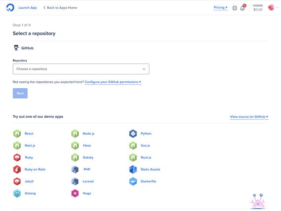


---

### ☁️ Function as a Service (FaaS) 

La frase _"serverless"_ no significa que los servidores ya no estén involucrados. Significa que los desarrolladores ya no tienen que pensar sobre ellos.

---

Se despliega un servicio (la 'función'), el cual esta inactivo hasta que un evento pasa que gatilla la función. Ese evento puede ser un mensaje en una cola, una llamada HTTP o cualquier otra cosa. El código corre hasta que termina y se apaga.

Pueden ejecutarte multiples funciones en paralelo y solo se te cobra por lo que se usa.

---

Por su naturaleza, FaaS tiende a entregar menor control sobre la ejecución, tiempo, recursos y limita que lenguajes/frameworks se pueden utilizar.

Además, algunos _runtimes_, les toma tiempo ejecutar una nueva versión, haciendo más lenta las llamadas.

---

<!-- _class: default -->
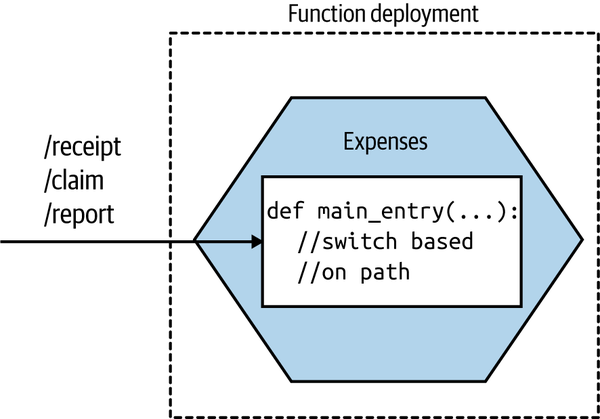

---

<!-- _class: default -->
## Entonces... **¿Cómo despliego mi aplicación?** No existe respuesta correcta, es un constante trade-off entre control/aislamiento vs facilidad de despliegue/costos.

---

## ☸ Kubernetes (k8s)

Nuestros sistemas requieren estar desplegados en multiples maquinas, para lo cual requerimos un sistema de orquestación de contenedores que se preocupe de correr (cuando lo requiramos) nuestros servicios, dejarlos disponibles en la red y manejar sus estados.

Kubernetes es la opción por defecto.

---

Kubernetes coordina un cluster de alta disponibilidad a traves de computadores que están conectados y trabajan como una única unidad. Esto lo hace automatizando la distribución y organización de los contenedores en la forma más eficiente.

---

<!-- _class: default -->


Un **cluster** tiene dos tipos de recursos:
- **Sistema de control**: administrar el clúster.
- **Nodos**: maquinas virtuales o físicas donde se ejecutan los contenedores.

---

<!-- _class: default -->


Los **Deployment** son instrucciones para k8s de como crear y actualizar las instancias de la aplicación. Se preocupa que, incluso si se borra o falla un nodo, el sistema se recupere solo.

---

<!-- _class: default -->


Un **Pod** es un grupo de contenedores. Incluye sus recursos como almacenamiento (**volumes**), **IP única** en el cluster e información de como correr cada contenedor.

---

<!-- _class: default -->


Un **Service** es una abstracción que permite definir como acceder a un conjunto de **Pods**.

---

Los **Services** pueden ser:
- **ClusterIP**: expone un servicio internamente.
- **NodePort**: expone el servicio externamente ```<NodeIP>:<NodePort>```.
- **LoadBalancer**: un balanceador de carga, al cual se asigna una IP externa.
- **ExternalName**: redirige el contenido del servicio al campo ```externalName```(ej. foo.bar.example.com).


---

### Escalar un servicio (1)
<!-- _class: default -->


--- 

### Escalar un servicio (2)
<!-- _class: default -->


---

### Actualizar un servicio (1)

<!-- _class: default -->


---

### Actualizar un servicio (2)

<!-- _class: default -->


---

### Actualizar un servicio (3)

<!-- _class: default -->


---

### Actualizar un servicio (4)

<!-- _class: default -->


---

## 🧩 Ejemplo: `./demo_06`

- Un _middleware_ con archivos de configuración para levantarlo en _docker-compose_ y _Kubernetes_.
- El archivo de configuración de la Integración Continua (```.gitlab-ci.yml```).

---

<!-- _class: default -->

# 📝 Tarea

Sube tu microservicio al cluster Kubernetes, idealmente mediante Integración Continua. Los cambios realizados al agregador y la interfaz se van a subir en clases en turnos.

---

## 📚 Material complementario
- Building microservices: Designing fine-grained systems, Sam Newman (2021). O'Reilly. Capitulo 8.
- [Learn Kubernetes Basics](https://kubernetes.io/docs/tutorials/kubernetes-basics/)