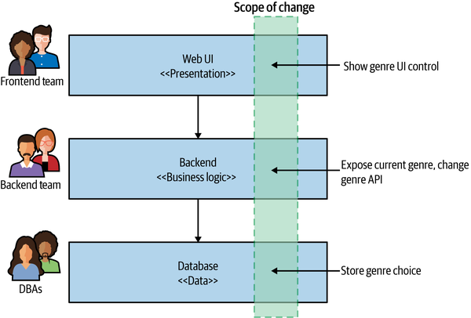
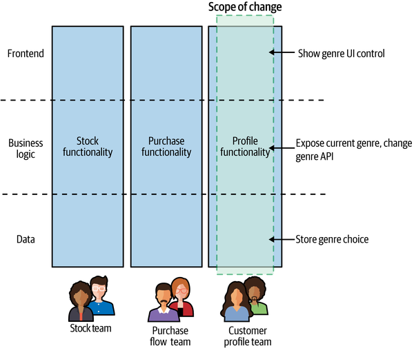
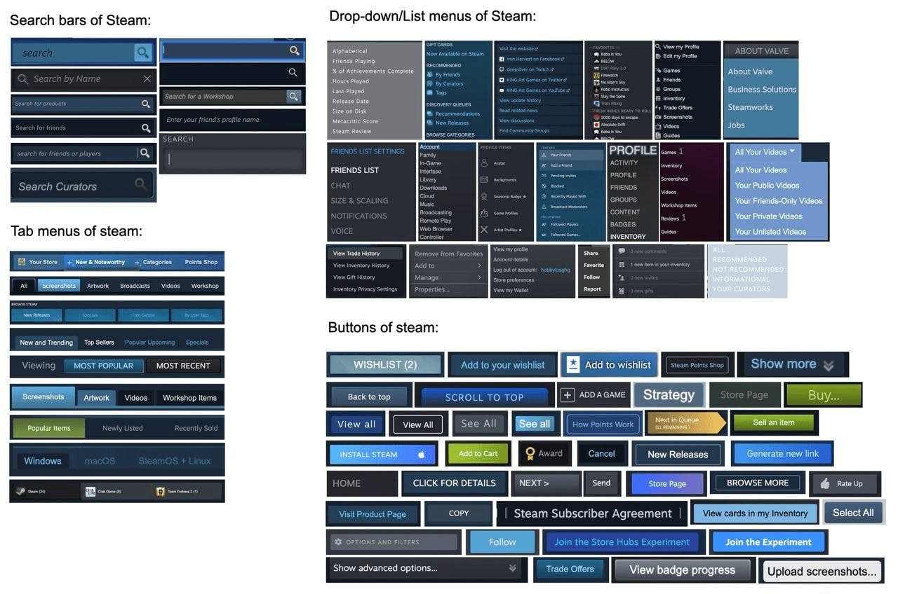
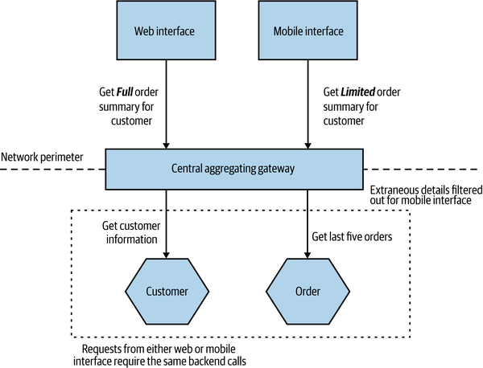
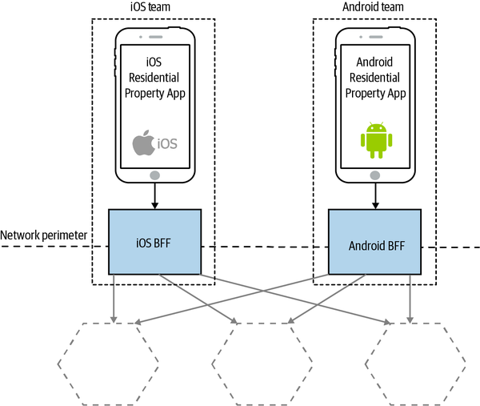
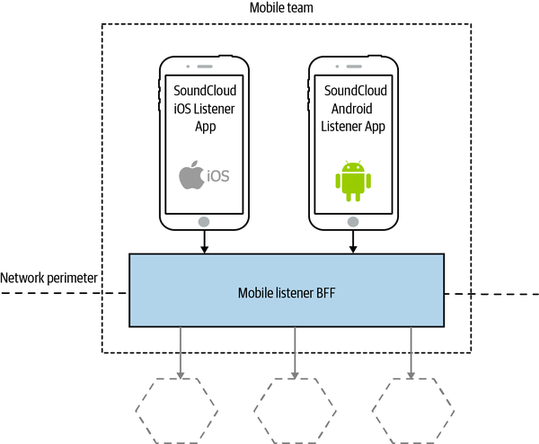

<!-- marp: true -->
<!-- theme: uncover -->
<!-- class: invert -->
<!-- paginate: true -->
<!-- footer: Microservicios por Rafik Mas'ad Nasra -->
<!-- author: Rafik Mas'ad Nasra -->
<!-- title: Introducción a microservicios -->
<!-- size: 16:9 -->

## Unidad 5
# Interfaz

---

<!-- _class: default -->
### Hasta ahora hemos desarrollado API que, habitualmente, no son utilizables por usuarios que esperan (bellas) interfaces.

---

## 👑 Modelos de propiedad

En microservicios, habitualmente, cambia la estructura de responsabilidad/propiedad sobre el trabajo. Los equipos pasan de trabajar en capas de abstracción a hacerse cargo, de principio a fin, en funcionalidades.

---

<!-- _class: default -->

---

<!-- _class: default -->

---

## 👯​ Hacia equipos alineados

"Un equipo alineado se enfoca con un único y valioso flujo de trabajo... el equipo está facultado para construir y entregar valor del cliente o usuario tan rápido, de forma segura e independiente como sea posible, sin requerir transferencias a otros equipos para realizar partes del trabajo." Team topologies, de Skelton et al.

---

_Full-stack_ teams por sobre _full-stack developers_. Un equipo responsable de principio a fin de entregar valor a los usuarios va a tener una mejor conexión/empatía con dichos usuarios.

---

### 🧐 Especialistas

Encontrar buenos especialistas (diseñadores, UX, front-end, etc) para cada equipo es un tema complejo. Existen dos modelos para lograr equipos _full-stack_:

- Incluir un especialista por cada equipo.
- Tener un equipo (pequeño) de especialistas que ayude y enseñe a los equipos las habilidades que requieren.

---

### 🎨 Consistencia

Para asegurar consistencia en la interfaz es importante mantener ordenado un sistema de componentes y tener un sistema de diseño. Para eso existen framework (como [Chakra], Boostrap o Material Design) y patrones como [Atomic Design].

---

<!-- _class: default -->

El no-sistema de diseño de Steam.

---

## 🚪 Gateway de agregación central

Se encuentra entre las interfaces de usuario y los microservicios. Realiza filtrado y agregación de las llamadas. Sin esta agregación, la interfaz tendría que realizar multiples llamadas (centenares en algunos casos) para obtener los datos de una vista y en dichas llamadas, se obtendrían datos no requeridos.

---

<!-- _class: default -->

---

## 🫂 Back-end For Frontend (BFF)

La principal distinción entre un BFF y un Gateway de agregación central es que un BFF tiene un solo propósito, es desarrollado para una interfaz (o un tipo de interfaz) de usuario. Este patrón demostró ser muy exitoso en ayudar a manejar las diferente preocupaciones de las interfaces de usuario.

---

### 🧮 ¿Cuantos BFF?

- Estrictamente un solo BFF para cada tipo diferente de cliente, este.
- El mismo BFF para más de un tipo de cliente, pero para el mismo tipo de interfaz.

---

<!-- _class: default -->

---

<!-- _class: default -->

---

## 🧩 Ejemplo: `./demo_05`

- Interfaz funcionando con React. Se conecta al _API Gateway_, en _GraphQL_, a `demo_04`.
- Usa [Chakra] como sistema de componentes/diseño.
- Si se cae el servicio de *teams* sigue funcionando la vista de jugadores.
- Se obtienen datos y se realizan mutaciones.

---

<!-- _class: default -->

# 📝 Tarea

Implementa la interfaz del microservicio asignado para el trabajo final. Para esto debes implementar en el servicio de *API Gateway* la conexión con el servicio y en la interfaz las funcionalidades obteniendo y modificando los datos desde *API Gateway*.

---

<!-- _class: default -->

La _network_ en _docker-compose_ se va a llamar 'microsvcs'.

Para evitar choque entre equipos, desarrolle el código de el _API Gateway_ y la interfaz en una rama con el nombre del servicio.

---

## 📚 Material complementario
- Building microservices: Designing fine-grained systems, Sam Newman (2021). O'Reilly. Capitulo 14.
- Skelton, M., Pais, M., &amp; Malan, R. (2019). Team topologies: Organizing business and technology teams for fast flow. It Revolution. 

[Chakra]: https://chakra-ui.com/
[Atomic Design]: https://atomicdesign.bradfrost.com/chapter-2/