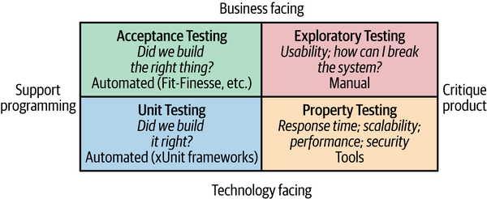
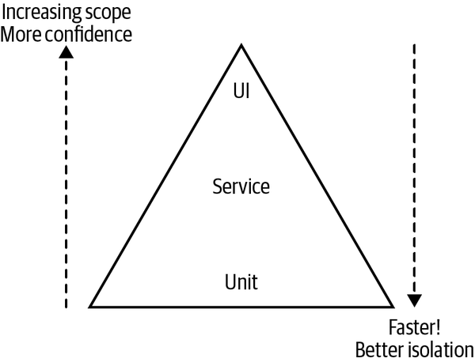
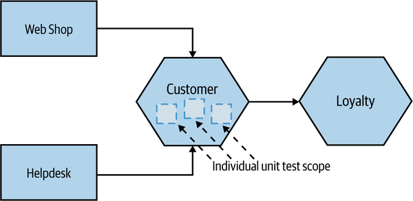
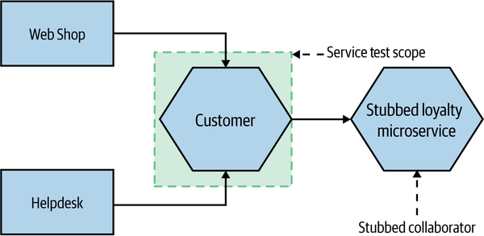
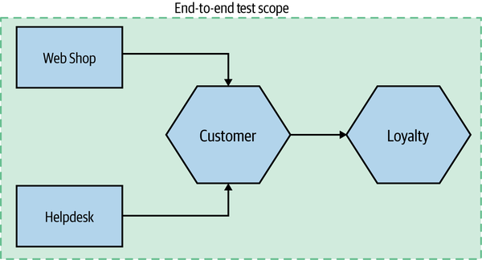
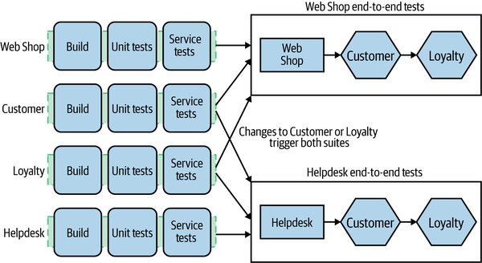
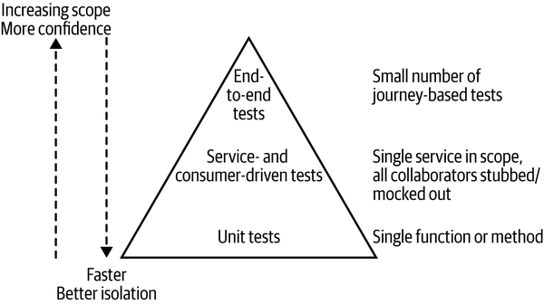

<!-- marp: true -->
<!-- theme: uncover -->
<!-- class: invert -->
<!-- paginate: true -->
<!-- footer: Microservicios por Rafik Mas'ad Nasra -->
<!-- author: Rafik Mas'ad Nasra -->
<!-- title: Introducción a microservicios -->
<!-- size: 16:9 -->

<style>    
    ul { margin: 0; }
    section.invert p { text-align: left; }
    section.invert h4 { text-align: left; }
</style>

## Unidad 7
# Control de Calidad

---

<!-- _class: default -->

### En el desarrollo ágil, en particular microservivicios, nos enfrentamos a la contradicción de poner en producción nuestro software lo más rápido posible y asegurar cumpla estándares de calidad.

---

<!-- _class: default -->



Brian Marick’s testing quadrant.

---

- La mayoría de estas pruebas se centran en asegurar la calidad previo a desplegar la aplicación en producción.
- Que estas pruebas pasen (o fallen) decide si el sistema si el sistema debe ser desplegado.
- Un porcentaje importante de estas pruebas deben ser automáticas (y su ejecución también).
- En este capitulo vamos a ignorar el control de calidad manual, no por que no sea importante (¡lo és!). Este no es un curso de Control de Calidad.

---

## 🎯 Alcance de las pruebas

Se pueden dividir las pruebas automatizadas en pruebas unitarias (_unit tests_), pruebas de servicios (_service tests_) y de interfaz. 

---

<!-- _class: default -->



Mike Cohn’s test pyramid.

---

Más arriba en la pirámide, nuestra confianza en las pruebas aumenta. 

Más abajo en la pirámide, más rápido es identificar los errores, el ciclo de retroalimentación más pequeños y el error esta más aislado.

---

## 🧪 Pruebas Unitarias

Prueban, habitualmente, una sola función o método. Se popularizaron por metodologías como test-driven development (TDD). Con estas pruebas se espera capturar la mayoría de los errores.

Él objetivo principal de estas pruebas es tener retroalimentación rápida si el código si la funcionalidad esta bien.

---

<!-- _class: default -->



---

🧩 Ejemplo de pruebas unitarias

```python
# main.py
def mean(*args): return sum(*args)/len(*args);

# tests.py
from main import mean; import unittest;

class TestMean(unittest.TestCase):
    def test_1(self):
        self.assertEqual(mean([10, 10, 10]), 10)

    def test_2(self):
        self.assertEqual(mean([5, 3, 4]), 4)

if __name__ == '__main__':
    unittest.main()
```
---

## 👨‍🔧 Pruebas de servicios

Son pruebas directamente a los microservicios. En una aplicación  monolítica, se prueban los recursos que provee el servicio a la interfaz.

En microservicios, se prueba cada uno de los servicios.

---

<!-- _class: default -->



---

🧩 Ejemplo de pruebas de servicios

```python
from fastapi.testclient import TestClient

from .main import app

client = TestClient(app)

def test_read_item():
    response = client.get("/items/foo",
                          headers={"X-Token": "coneofsilence"})
    assert response.status_code == 200
    assert response.json() == {"id": "foo",
                               "title": "Foo",
                               "description": "There goes my hero"}
```

---

```python
...

def test_read_item_bad_token():
    response = client.get("/items/foo",
                          headers={"X-Token": "hailhydra"})
    assert response.status_code == 400
    assert response.json() == {"detail": "Invalid X-Token header"}


def test_read_inexistent_item():
    response = client.get("/items/baz",
                          headers={"X-Token": "coneofsilence"})
    assert response.status_code == 404
    assert response.json() == {"detail": "Item not found"}
```

---

- Al realizarse pruebas con componentes en una red o en bases de datos, habitualmente son más lentos que las pruebas unitarias.

- Cuando se requiere probar datos que requieren interacción con otros servicios existen distintas estrategias para aislar las pruebas.

---

### ➗ Estrategias para aislar las pruebas

- **Objetos ficticios** (_dummy_) que se pasan pero nunca se usan. Por lo general, solo se usan para llenar las listas de parámetros.
- **Objetos falsos** (_fake_) que son similares a valores reales pero con alguna clase de atajo (marcados como _fake_ o se guardan en una base de datos en memoria por ejemplo).


---

- Los **_stubs_** proporcionan respuestas enlatadas a las llamadas realizadas durante la prueba, que generalmente no responden a nada fuera de lo que está programado para la prueba.

- Los **simulacros** (_mocks_) son respuestas pre-programadas ante una llamada determinada.

---

## 💻 Pruebas de principio a fin

Habitualmente se realizan sobre la interfaz aunque se pueden realizar probando interacciones complejas entre varios servicios.

Que estas pruebas funcionen da un alto nivel de confianza en que el conjunto de funcionalidades a probar funciona.


---

<!-- _class: default -->



---

Para estas pruebas habitualmente se utilizan frameworks como [Selenium](https://www.selenium.dev/). Se debe automatizar la ejecución de estas pruebas.

Un problema de estas pruebas es que al fallar, es difícil determinar la causa del falló. Sobre todo si hay muchos servicios relacionados.

Además, al fallar una prueba que involucra multiples servicios ¿De que equipo es la responsabilidad?

---

<!-- _class: default -->



---

### En resumen...

<!-- _class: default -->



---

## ⚠️ Pruebas en producción

Los sistemas en producción se enfrentan a escenarios distintos a los de entornos de pruebas. Gran cantidad de consultas, flujos no probados por parte de los usuarios finales o eventos inesperados. 

Para esto, habitualmente se implementan estrategias como _health checks_ y _canary release_.

---

Un _health check_ es realizar consultas periódicas para corroborar que el servicio esta sano (respondiendo normalmente consultas).

Las _canary release_ son versiones que utilizan un porcentaje menor de usuarios con la finalidad de que errores descubiertos en flujos reales no lleguen a todos los usuarios.

---


🧩 Ejemplo de _health check_ en Kubernetes


```yaml
    livenessProbe:
      httpGet:
        # Este end-point debe ser 
        # implementado en el servicio
        path: /healthz 
        port: 8080
        httpHeaders:
        - name: x-header
          value: Awesome
```

---

<!-- _class: default -->

# 📝 Tarea

Agrega a tu microservicio pruebas de servicio. Como mínimo, se espera dos pruebas por _end-point_.

Se recomienda leer para esta tarea [FastAPI testing tutorial].

---

## 📚 Material complementario
- Building microservices: Designing fine-grained systems, Sam Newman (2021). O'Reilly. Capitulo 7.
- [FastAPI testing tutorial].
- [Mocks Aren't Stubs](https://martinfowler.com/articles/mocksArentStubs.html), Martin Fowler (2007).
- [Configure Liveness, Readiness and Startup Probes, Kubernetes](https://kubernetes.io/docs/tasks/configure-pod-container/configure-liveness-readiness-startup-probes)

[FastAPI testing tutorial]: (https://fastapi.tiangolo.com/tutorial/testing/)