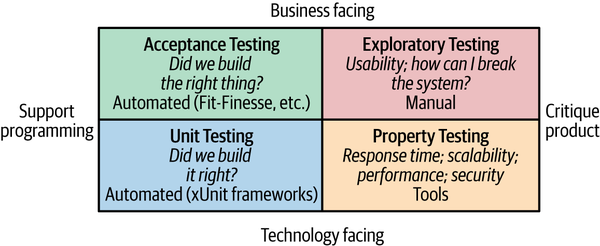
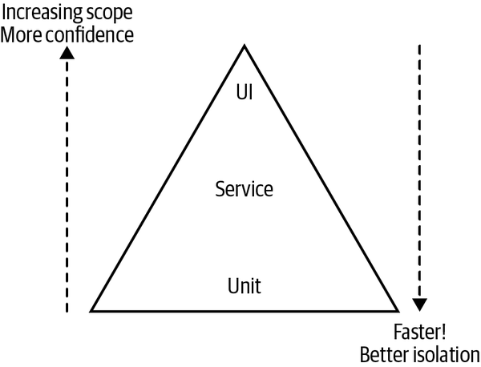
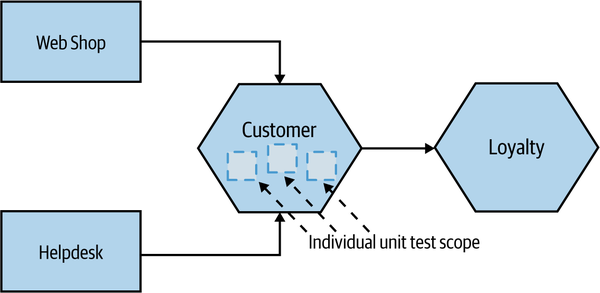
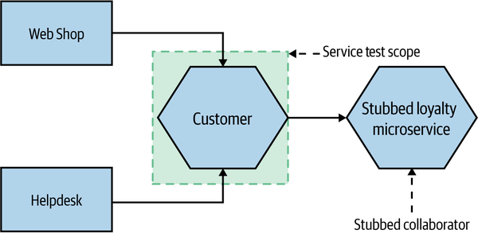
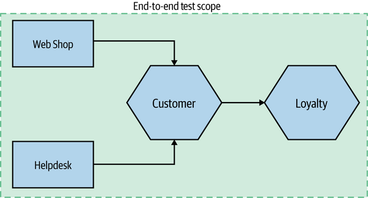
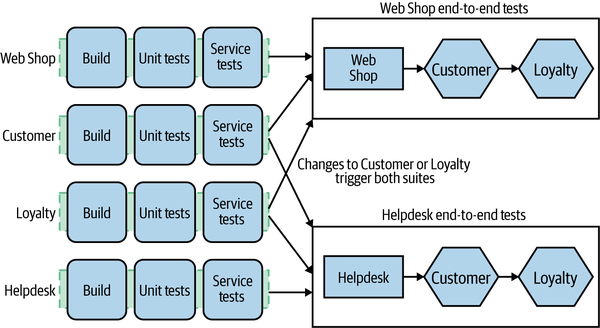
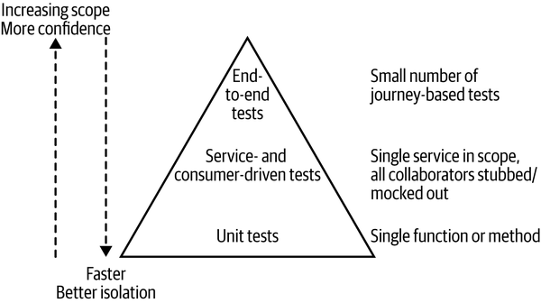

<!-- marp: true -->
<!-- theme: uncover -->
<!-- class: invert -->
<!-- paginate: true -->
<!-- footer: Microservicios por Rafik Mas'ad Nasra -->
<!-- author: Rafik Mas'ad Nasra -->
<!-- title: Control de Calidad -->
<!-- size: 16:9 -->

<style>    
    ul { margin: 0; }
    section.invert p { text-align: left; }
    section.invert h4 { text-align: left; }
</style>

## Unidad 7
# Control de Calidad

---

<!-- _class: default -->

### En el desarrollo ágil, en particular en microservicios, nos enfrentamos a la contradicción de poner en producción nuestro software lo más rápido posible y asegurar que cumpla estándares de calidad.

---

<!-- _class: default -->



Brian Marick’s testing quadrant.

---

- La mayoría de estas pruebas se centran en asegurar la calidad previo a desplegar la aplicación en producción.
- Que estas pruebas pasen (o fallen) decide si el sistema debe ser desplegado.
- Un porcentaje importante de estas pruebas deben ser automáticas (y su ejecución también).
- En este capítulo vamos a ignorar el control de calidad manual, no porque no sea importante (¡lo es!). Este no es un curso de Control de Calidad.

---

## 🎯 Alcance de las pruebas

Se pueden dividir las pruebas automatizadas en pruebas unitarias (_unit tests_), pruebas de servicios (_service tests_) y de interfaz. 

---

<!-- _class: default -->



Mike Cohn’s test pyramid.

---

Más arriba en la pirámide, nuestra confianza en las pruebas aumenta. 

Más abajo en la pirámide, más rápido es identificar los errores, el ciclo de retroalimentación es más corto y el error está más aislado.

---

## 🧪 Pruebas Unitarias

Prueban, habitualmente, una sola función o método. Se popularizaron por metodologías como test-driven development (TDD). Con estas pruebas se espera capturar la mayoría de los errores.

El objetivo principal de estas pruebas es tener retroalimentación rápida de si la funcionalidad está bien implementada.

---

<!-- _class: default -->



---

🧩 Ejemplo de pruebas unitarias

```python
# main.py
def mean(values):
    return sum(values) / len(values)

# tests.py
import unittest
from main import mean

class TestMean(unittest.TestCase):
    def test_promedio(self):
        self.assertEqual(mean([10, 10, 10]), 10)

    def test_lista_vacia(self):
        # Caso borde: aquí es donde un test aporta valor.
        # mean([]) divide por cero.
        with self.assertRaises(ZeroDivisionError):
            mean([])

if __name__ == '__main__':
    unittest.main()
```
---

## 👨‍🔧 Pruebas de servicios

Son pruebas directamente a los microservicios. En una aplicación  monolítica, se prueban los recursos que provee el servicio a la interfaz.

En microservicios, se prueba cada uno de los servicios.

---

<!-- _class: default -->



---

🧩 Ejemplo de pruebas de servicios

```python
from fastapi.testclient import TestClient

from .main import app

client = TestClient(app)

def test_read_item():
    response = client.get("/items/foo",
                          headers={"X-Token": "coneofsilence"})
    assert response.status_code == 200
    assert response.json() == {"id": "foo",
                               "title": "Foo",
                               "description": "There goes my hero"}
```

---

```python
...

def test_read_item_bad_token():
    response = client.get("/items/foo",
                          headers={"X-Token": "hailhydra"})
    assert response.status_code == 400
    assert response.json() == {"detail": "Invalid X-Token header"}


def test_read_inexistent_item():
    response = client.get("/items/baz",
                          headers={"X-Token": "coneofsilence"})
    assert response.status_code == 404
    assert response.json() == {"detail": "Item not found"}
```

---

- Al realizarse pruebas con componentes en una red o en bases de datos, habitualmente son más lentas que las pruebas unitarias.

- Cuando se requiere probar datos que requieren interacción con otros servicios existen distintas estrategias para aislar las pruebas.

---

### ➗ Estrategias para aislar las pruebas

- **Objetos ficticios** (_dummy_) que se pasan pero nunca se usan. Por lo general, solo se usan para llenar las listas de parámetros.
- **Objetos falsos** (_fake_) que son similares a valores reales pero con alguna clase de atajo (marcados como _fake_ o se guardan en una base de datos en memoria por ejemplo).


---

- Los **_stubs_** proporcionan respuestas fijas a las llamadas realizadas durante la prueba. Con un _stub_ verificamos el **estado** resultante: le damos una respuesta enlatada al código y revisamos que el resultado final sea el esperado.

- Los **simulacros** (_mocks_) registran las interacciones que reciben. Con un _mock_ verificamos el **comportamiento**: qué se llamó, cuántas veces y con qué argumentos.

---

🧩 Ejemplo de _mock_ con `unittest.mock`

```python
from unittest.mock import Mock

def notificar_pago(usuario, notificador):
    notificador.enviar(usuario, "Pago recibido")

def test_notifica_al_usuario():
    notificador = Mock()
    notificar_pago("ana", notificador)
    # No verificamos un resultado: verificamos
    # que la llamada ocurrió y con qué argumentos.
    notificador.enviar.assert_called_with("ana", "Pago recibido")
```

---

## 💻 Pruebas de principio a fin

Habitualmente se realizan sobre la interfaz aunque se pueden realizar probando interacciones complejas entre varios servicios.

Que estas pruebas funcionen da un alto nivel de confianza en que el conjunto de funcionalidades a probar funciona.


---

<!-- _class: default -->



---

Para estas pruebas habitualmente se utilizan frameworks como [Selenium](https://www.selenium.dev/). Se debe automatizar la ejecución de estas pruebas.

Un problema de estas pruebas es que al fallar, es difícil determinar la causa de la falla. Sobre todo si hay muchos servicios relacionados.

Además, al fallar una prueba que involucra múltiples servicios ¿De qué equipo es la responsabilidad?

---

## 🤝 Pruebas de contrato

Un **contrato** es el acuerdo entre un servicio consumidor y uno proveedor: qué peticiones va a hacer el consumidor y qué respuestas espera (rutas, campos, tipos, códigos de estado).

Las pruebas de contrato verifican ese acuerdo sin levantar ambos servicios juntos.

---

En los _consumer-driven contracts_ (con herramientas como [Pact](https://pact.io/)) el flujo es:

1. El equipo consumidor escribe pruebas contra un _mock_ del proveedor. De ahí se genera el **pacto** (un archivo con las interacciones esperadas).
2. El pacto se comparte con el equipo proveedor.
3. El CI del proveedor ejecuta el pacto contra el servicio real: si una respuesta deja de cumplir lo que el consumidor espera, el pipeline falla **antes** de desplegar.

---

¿Por qué importan? Porque responden la pregunta de la responsabilidad: cada pacto tiene un consumidor y un proveedor claros. Si el pacto falla, se sabe qué equipo rompió el acuerdo.

Con contratos verificados en CI, gran parte de las pruebas de principio a fin entre servicios se vuelve innecesaria: la integración ya está cubierta, servicio por servicio, sin el costo ni la fragilidad de levantar todo el sistema.

---

<!-- _class: default -->



---

### En resumen...

<!-- _class: default -->



---

## ⚠️ Pruebas en producción

Los sistemas en producción se enfrentan a escenarios distintos a los de entornos de pruebas. Gran cantidad de consultas, flujos no probados por parte de los usuarios finales o eventos inesperados. 

Para esto, habitualmente se implementan estrategias como _health checks_ y _canary release_.

---

Un _health check_ es realizar consultas periódicas para corroborar que el servicio está sano (respondiendo normalmente consultas).

Las _canary release_ son versiones que utilizan un porcentaje menor de usuarios con la finalidad de que errores descubiertos en flujos reales no lleguen a todos los usuarios.

---


🧩 Ejemplo de _health check_ en Kubernetes


```yaml
    livenessProbe:
      httpGet:
        # Este end-point debe ser 
        # implementado en el servicio
        path: /healthz 
        port: 8080
        httpHeaders:
        - name: x-header
          value: Awesome
```

---

Kubernetes distingue dos tipos de _probe_:

- `livenessProbe`: si falla, Kubernetes **reinicia** el contenedor. Sirve para recuperarse de un servicio colgado.
- `readinessProbe`: si falla, Kubernetes **deja de enviarle tráfico** al pod, sin reiniciarlo.

En microservicios la más importante es la de _readiness_: un servicio que todavía no conecta a su base de datos o no cargó su configuración no debe recibir peticiones, aunque el proceso esté vivo.

---

🧩 Ejemplo de `readinessProbe`

```yaml
    readinessProbe:
      httpGet:
        # Debe responder 200 solo cuando el
        # servicio puede atender peticiones
        # (por ejemplo, con la BD conectada)
        path: /ready
        port: 8080
      initialDelaySeconds: 5
      periodSeconds: 10
```

---

<!-- _class: default -->

# 📝 Tarea

Agrega a tu microservicio pruebas de servicio. Se exige:

- Como mínimo, dos pruebas por _end-point_, y al menos una de ellas debe ser un caso de error (entrada inválida, recurso inexistente, credencial incorrecta).
- Las pruebas deben estar aisladas de la base de datos real: usa una BD de pruebas mediante _override_ de dependencias de FastAPI o una _fixture_ que la cree y destruya.
- Las pruebas deben ejecutarse en tu pipeline de CI en cada _push_.

Se recomienda leer para esta tarea [FastAPI testing tutorial].

---

### Rúbrica de la tarea

| Criterio | Puntaje |
|---|---|
| Dos pruebas por end-point, incluyendo un caso de error | 40 |
| Aislamiento de la BD (override o fixture) | 30 |
| Pruebas corriendo en CI | 20 |
| Código de pruebas legible y ordenado | 10 |

---

## 📚 Material complementario
- Building microservices: Designing fine-grained systems, Sam Newman (2021). O'Reilly. Capítulo 7.
- [FastAPI testing tutorial].
- [Mocks Aren't Stubs](https://martinfowler.com/articles/mocksArentStubs.html), Martin Fowler (2007).
- [Pact documentation](https://docs.pact.io/)
- [Configure Liveness, Readiness and Startup Probes, Kubernetes](https://kubernetes.io/docs/tasks/configure-pod-container/configure-liveness-readiness-startup-probes)

[FastAPI testing tutorial]: https://fastapi.tiangolo.com/tutorial/testing/