<!-- marp: true -->
<!-- theme: uncover -->
<!-- class: invert -->
<!-- paginate: true -->
<!-- footer: Microservicios por Rafik Mas'ad Nasra -->
<!-- author: Rafik Mas'ad Nasra -->
<!-- title: Introducción a microservicios -->
<!-- size: 16:9 -->

## Unidad 8
# Seguridad, resiliencia y escalabilidad

---

# Seguridad

---

Al comparar microservicios con arquitecturas menos distribuidas, nos encontramos con una dicotomía:
- Más datos fluyendo por redes, infraestructura más compleja, nuestra superficie de ataque es mucho mayor.
- Más oportunidades para defendernos en profundidad y limitar el alcance del acceso.

---

## Principios centrales

#### Principio de privilegio mínimo

Otorgar el acceso, y por el tiempo, mínimo necesario.

Así aseguramos que si las credenciales son comprometidas, esas credenciales darán el acceso más limitado posible.

---

Si un microservicio solo tiene acceso de lectura a una base de datos, entonces un atacante que obtenga acceso a esas credenciales solo obtendrá acceso de lectura, y solo a esa base de datos.

Si la credencial para acceder a otro servicio expira antes de que se vea comprometida, entonces la credencial se vuelve inútil.

---

#### Defensa en profundidad

Un único mecanismo de protección puede ser insuficiente si es vulnerado. Al pensar la seguridad de nuestras aplicaciones, es vital tener múltiples protecciones.

En microservicios, hay más lugares para proteger nuestros sistemas. Dividir nuestra funcionalidad en diferentes microservicios ya es una aplicación de defensa en profundidad.

---

<!-- _class: default -->

##### Tipos de controles de seguridad

- Preventivo: evitar que ocurra un ataque. Esto incluye almacenar secretos de forma segura, cifrar datos en reposo y en tránsito, e implementar mecanismos adecuados de autenticación y autorización.

---

<!-- _class: default -->

- Detectivo: alertarte del hecho que un ataque está ocurriendo/ha ocurrido. Los cortafuegos de aplicaciones y los servicios de detección de intrusos son buenos ejemplos.

- Reactivo: ayudarte a responder durante/después de un ataque. Tener un mecanismo automatizado para reconstruir tu sistema, copias de seguridad funcionales para recuperar datos, y un plan de comunicación adecuado tras un incidente puede ser vital.

---

#### Automatización

En microservicios son muchos los componentes y al tener entregas continuas, la automatización es esencial.

Los ordenadores son más eficientes que los humanos al repetir tareas: lo hacen más rápido, con más eficiencia y menos variabilidad.

---

La automatización ayuda a recuperarse tras un incidente, como revocar y rotar claves de seguridad.

También permite el uso de herramientas para detectar problemas de seguridad más fácilmente.

Al igual que otros aspectos de la arquitectura de microservicios, adoptar una cultura de automatización mejora enormemente la seguridad.

---

#### Seguridad como un proceso

La seguridad en la entrega de software a menudo se considera como una reflexión posterior, un obstáculo para entregar o un añadido.

Se deben entender de forma sistémica e integrar en el proceso.

Existen herramientas automáticas para detectar vulnerabilidades tanto en sistemas, librerías y el código. Es esencial integrar estas herramientas en procesos del CI.

---

### Las cinco funciones de seguridad

Vamos a ver el modelo que describe la US National Institute of Standards and Technology (NIST), que describe cinco funciones de seguridad.

---

#### Identificar

Necesitamos identificar quién podría querer atacar nuestros sistemas y qué buscan. Los humanos a menudo no entienden bien el riesgo y se centran en problemas menores (más técnicos) mientras ignoran problemas mayores (más estructurales).

Sin una comprensión completa del sistema, es fácil pasar por alto áreas críticas de seguridad. Modelar las amenazas en arquitecturas de microservicios puede ser más complejo.

---

#### Proteger

Es esencial proteger nuestros activos más valiosos y vulnerables. Este punto es particularmente complejo en microservicios, ya que aumentan la superficie de ataque.

---

#### Detectar

Detectar incidentes en arquitecturas de microservicios es más complejo. Hay más redes y máquinas que monitorear, lo que aumenta los lugares a observar.

La agregación de registros, pueden ayudar a detectar posibles problemas. Hay herramientas especializadas como sistemas de detección de intrusiones para identificar comportamientos maliciosos.

---

#### Responder

Ante un incidente de seguridad, es crucial tener un enfoque de respuesta efectivo para limitar el daño. Comenzar por entender el alcance del incidente y qué datos se han expuesto.

Si se expone información personal identificable (PII), se deben seguir procesos de respuesta y notificación de incidentes de seguridad y privacidad. Además, los procedimientos legales según la regulación respectiva.

---

#### Recuperar

Volver a dejar funcional el sistema posterior a un ataque. En microservicios, al tener más componentes, es más complejo.

Cosas como la automatización y las copias de seguridad pueden ayudar a reconstruir un sistema de microservicios bajo demanda y volver a ponerlo en funcionamiento lo antes posible.

---

### Fundamentos de la Seguridad de Aplicaciones

Las actividades de seguridad abarcan una amplia gama de temas.

--- 

#### Credenciales

Otorgan acceso a recursos restringidos como bases de datos, computadoras, cuentas de usuario, etc. Las arquitecturas de microservicios introducen más credenciales en comparación con las arquitecturas monolíticas.

Los enfoques demasiado simplificados o "perezosos", como el uso de amplios privilegios, pueden llevar a vulnerabilidades.

--- 

**Credenciales de Usuario**: Las credenciales que los usuarios utilizan para acceder a los sistemas.

A menudo son un punto débil; frecuentemente son el objetivo de los hackers. 80% de los casos de hacking involucraron algún tipo de robo de credenciales (informe Verizon de 2020).

---

**Secretos**: Información crítica requerida por los microservicios, como certificados TLS, claves SSH, claves API y credenciales de bases de datos.

El ciclo de vida de los secretos incluye creación, distribución, almacenamiento, monitoreo y rotación.

Herramientas como Kubernetes ayudan en la gestión de estos secretos. Proveedores de la nube también ofrecen soluciones como AWS Secrets Manager y Azure's Key Vault.

---

**Rotación**: cambiar las credenciales con regularidad para limitar el daño que alguien puede hacer si obtiene acceso. Es recomendable adoptar herramientas que automatizan este proceso.

---

**Revocación**: si se sabe que una credencial ha sido comprometida, no es práctico esperar a la próxima rotación programada.

---

**Escaneo de claves**: es común que las claves privadas se suban accidentalmente a repositorios de código fuente. GitHub escanea automáticamente los repositorios en busca de ciertos tipos de secretos, pero también se pueden usar herramientas.

---

**Alcance limitado**: la idea principal es el principio de "menor privilegio", es decir, otorgar solo los permisos necesarios.

Si se limita el alcance de lo que una credencial permite, se reduce el potencial daño. Por ejemplo, si una credencial da acceso de solo lectura, un atacante no podría modificar nada, incluso si obtiene acceso.

---

#### Backups

Los datos son invaluables y su pérdida puede ser catastrófico. Por lo tanto, las copias de seguridad regulares son esenciales para preservar estos datos.

Es fundamental probar regularmente los respaldos, para corroborar su integridad.

---

#### Rebuild

Reconstruir recurrentemente el sistema desde cero, para que si el sistema se vio comprometido, se elimine el software malicioso y el acceso del atacante.

Esto es más fácil de hacer con microservicios y contenedores.

---

### Confianza implícita vs. cero confianza

**Confianza implícita**: asumir que las llamadas internas dentro del perímetro son de confianza. Puede ser adecuado dependiendo de la sensibilidad de los datos.

Riesgo: un atacante dentro de la red podría causar un caos significativo.

---

**Cero confianza**: asumir que todas las llamadas son potencialmente maliciosas. Requiere más esfuerzo, pero es más seguro. Los conceptos de "perímetro" no tienen significado; asume la necesidad de cifrar datos y validar comunicaciones constantemente.

No es un producto o herramienta, sino un enfoque y principio de seguridad Requiere evaluación y verificación constante de la confianza en todas las comunicaciones. 

---

Es un espectro...

No hay una elección binaria entre confianza implícita y cero confianza. La extensión de la confianza puede variar con la sensibilidad de la información. Decisiones basadas en el modelo de amenazas y el impacto asociado.

---

### Seguridad en los datos

**Datos en tránsito**: protección depende del protocolo de comunicación. Hay cuatro áreas clave de interés: identidad del servidor, identidad del cliente, visibilidad de los datos, manipulación de datos.

---

Para esto:

- Uso de TLS para HTTP para seguridad adicional.
- Identidad de cliente verificada mediante secretos compartidos o certificados.
- TLS mutuo para la autenticación de microservicios en ambos sentidos.
- Cifrado con TLS previene la visualización y manipulación de datos.

---

**Datos en reposo**: datos sensibles deben ser protegidos para evitar ser leídos o robados. Para esto: 

- Uso de software y algoritmos de cifrado conocidos y probados.
- Cifrado de contraseñas con técnicas de hash saladas. Considerar la sobrecarga computacional de cifrar todo.
- Encriptar solo los datos necesarios y ser prudentes con el almacenamiento de información.

---

### Autenticación y autorización

**Autenticación**: Proceso de confirmar que una parte es quien dice ser. Típicamente se hace con nombre de usuario y contraseña. Evitar múltiples inicios de sesión para diferentes microservicios.

**Autorización**: Proceso de asignar acciones permitidas a un principal autenticado. Se basa en la información recibida durante la autenticación.

---

**Autenticación de servicio a servicio**: TLS mutuo permite la autenticación del cliente y del servidor. Alternativas incluyen el uso de claves API para verificar solicitudes.

**Autenticación Humana**: Tradicionalmente con usuario y contraseña. Autenticación de múltiples factores
(MFA) aumenta seguridad.

---

### Inicio de Sesión Único (SSO)

Los usuarios se autentican una sola vez y acceden a múltiples servicios o aplicaciones sin necesidad de iniciar sesión nuevamente.

El usuario es redirigido al proveedor de identidad para autenticarse. Una vez autenticado, el proveedor de identidad informa al proveedor del servicio para decidir sobre el acceso del usuario.

---

Pueden ser sistemas alojados externamente o internamente en una organización.

El proveedor de identidad valida quién es el usuario, pero el sistema decide qué se le permite hacer.

---

#### SSO Gateway

En lugar de gestionar la autenticación en cada microservicio, se utiliza el _gateway_ como proxy. Centraliza la redirección y autenticación, evitando duplicidad de funcionalidad.

Una biblioteca compartida podría ayudar, pero se debe evitar por el acoplamiento que surge del código compartido. La SSO _gateway_ tiene beneficios incluso cuando los microservicios están escritos en diferentes tecnologías.

---

<!-- _class: default -->

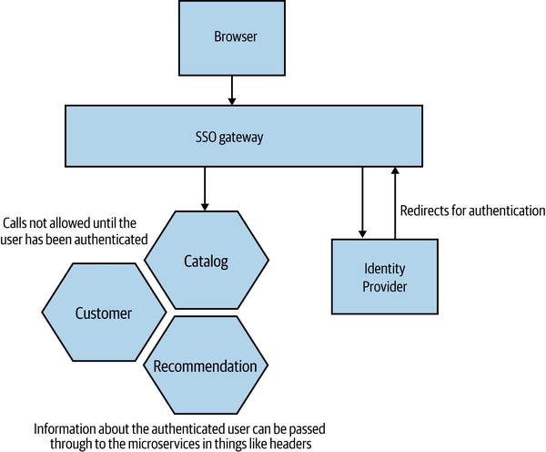

---

Los microservicios necesitan recibir información sobre los usuarios, como id o roles. Se puede pasar en las cabeceras de las peticiones.

Alternativamente, se puede usar un JSON Web Token (JWT) que contenga toda la información del usuario.

---

#### Autorización de Granularidad Fina

SSO _gateway_ puede proporcionar autenticación de granularidad gruesa eficaz, restringiendo el acceso a usuarios no autenticados o por grupos o roles.

Las decisiones sobre operaciones específicas deben ser manejadas por el microservicio, no por la pasarela.

---

Información sobre el comportamiento del servicio debe ser mantenida dentro del servicio para permitir un ciclo de vida independiente.

Evitar que una gran cantidad de información sobre el comportamiento de un servicio viva en sistemas gestionados por otras partes de la organización.

---

### JSON Web Tokens (JWT)

Permiten almacenar múltiples declaraciones (claims) sobre un usuario.

Pueden ser firmados para asegurar la integridad y opcionalmente encriptados para proteger la privacidad de los datos.

Comúnmente usados para transmitir información que ayuda a la autorización.

---

El JWT es una estructura JSON que puede contener cualquier dato necesario.

Contiene campos estándar ("public claims") como la fecha de expiración (exp).

---

Se pasan fácilmente a través de varios protocolos, como las cabeceras de una consulta HTTP.

Los microservicios pueden validar el token y extraer información para determinar la autorización apropiada.

---

<!-- _class: default -->

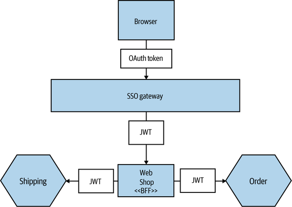

---

Pero existen desafíos, como la gestión de claves, la expiración del token y el tamaño del token.

La verificación de la firma requiere una clave pública, planteando preguntas sobre cómo y cuándo se actualiza y distribuye esa clave.

Determinar el periodo de validez apropiado puede ser complicado, especialmente en procesos largos o asíncronos.

---

La necesidad de incluir mucha información puede llevar a tokens demasiado grandes, lo que en casos excepcionales podría requerir manejar la autorización de forma diferente.

---

# Resiliencia

---

### ¿Qué es la resiliencia?

El termino se usa en muchos contextos, pero en general se refiere a la capacidad de recuperarse de un evento traumático.

---

David Woods, categorizó cuatro aspectos de la resiliencia:
- **Robustez**: Capacidad de absorber perturbaciones esperadas.
- **Recuperación**: Capacidad de recuperarse tras un evento traumático.
- **Extensibilidad**: Manejo de situaciones inesperadas.
- **Adaptabilidad sostenida**: Adaptación continua a entornos cambiantes.

---

### Robustez

Es la capacidad de incorporar mecanismos y procesos para manejar problemas esperados. En microservicios, enfrentamos diversas perturbaciones como fallos de host, desconexiones de red o indisponibilidad de un microservicio.

Algunas estrategias como remplazo automático de hosts, reintentos en operaciones, o un manejo elegante de fallos en microservicios.

---

#### Robustez como proceso

No solo se limita al ámbito del software, sino que también se extiende a las personas involucradas en el proceso.

Por ejemplo, si una persona clave no está disponible durante un incidente, es fundamental tener un plan de respaldo. Esta dimensión humana de la robustez subraya la necesidad de prever y prepararse para diversas contingencias.

---

### Conocimiento previo y mejora continua

La robustez se basa en el conocimiento de las perturbaciones conocidas, basados en la previsión y experiencia. Este conocimiento nos permite anticiparnos a problemas potenciales y aprender de situaciones inesperadas. Reconocer y adaptarse a fallas no anticipadas, como la indisponibilidad de un sistema de archivos global, es crucial para fortalecer nuestra robustez.

---

### Costo-beneficio

El incremento de la complejidad del sistema puede generar nuevos problemas. Cualquier mejora en la robustez debe sopesar no solo un análisis de costo-beneficio, sino también la disposición a gestionar un sistema más complejo.

La arquitectura de microservicios ofrece numerosas opciones para mejorar la robustez.

---

### Recuperación

La capacidad de recuperación, tras una interrupción es fundamental para construir un sistema resiliente. Es común observar un enfoque excesivo en prevenir interrupciones con una preparación insuficiente para cuando realmente ocurre un incidente. 

A medida que los sistemas se vuelven más grandes y complejos, es insostenible eliminar todos los problemas.

---

## Extensibilidad

La preparación para sorpresas es crucial; si solo consideramos escenarios previstos, nos arriesgamos a crear sistemas frágiles. Cuando los sistemas se enfrentan a situaciones que superan sus límites esperados, su rendimiento puede verse seriamente comprometido, llevando a fallos y disrupciones.

---

### Organizaciones planas y flexibilidad

Las organizaciones con estructuras más planas, donde las responsabilidades se distribuyen en lugar de centralizarse, suelen estar mejor preparadas para manejar imprevistos. En estos entornos, cuando ocurre lo inesperado, las personas no están limitadas por reglas estrictas y pueden adaptarse y responder de manera más efectiva.

---

### Optimización vs. Flexibilidad

En el afán de optimizar los sistemas, a veces inadvertidamente aumentamos su fragilidad. Un ejemplo claro es la automatización: si bien mejora la eficiencia y permite hacer más con menos recursos humanos, también puede reducir la capacidad del sistema para manejar sorpresas. La automatización no puede reemplazar la capacidad humana de responder a lo imprevisto.

---

### El rol humano

La presencia de trabajadores capacitados y versátiles es esencial para responder eficazmente a los desafíos no anticipados. Por lo tanto, un enfoque equilibrado que valore tanto la automatización como la experiencia humana es clave para una extensibilidad elegante en cualquier sistema u organización.

---

### Adaptabilidad sostenida

No importa cuán exitosos hayamos sido en el pasado, el futuro puede presentar desafíos inéditos para los cuales quizás no estemos preparados. La ausencia de fallos catastróficos en el pasado no garantiza su imposibilidad en el futuro. Por tanto, es crucial desafiarnos continuamente para adaptarnos y asegurar la resiliencia futura.

---

#### Caos controlado

introducir deliberadamente el caos en nuestros sistemas es una forma de probar la resiliencia de nuestros sistemas y nuestra capacidad para responder a lo inesperado.

---

#### Visión holística vs. Optimización local

La adaptabilidad sostenida a menudo exige una visión holística del sistema. Existe un delicado equilibrio entre la optimización global y local en la dinámica organizacional. La creación de equipos autónomos y focalizados puede llevar a perder de vista el panorama general. Fundamental el rol de los arquitectos de software para mantener la visión holística.

---

#### Cultura de aprendizaje

Fomentar una cultura en la que se comparta información libremente y sin temor a represalias es vital para el aprendizaje continuo. La capacidad de examinar sorpresas, extraer aprendizajes clave y adaptarse requiere tiempo, energía y recursos humanos, lo cual puede afectar la entrega de nuevas funcionalidades a corto plazo.

---

#### Entrega vs. Adaptabilidad

Abrazar la adaptabilidad sostenida significa encontrar un punto de equilibrio entre las entregas a corto plazo y la adaptabilidad a largo plazo. Esto requiere una inversión continua y un enfoque estratégico, haciendo de la adaptabilidad sostenida una parte integral de la estrategia y cultura organizacional. La adaptabilidad sostenida no es un esfuerzo puntual, sino un compromiso continuo con el descubrimiento y la adaptación.

---

### Los fallos son inevitables

Debemos reconocer que las fallas son una parte inevitable de cualquier sistema. Desde discos duros que fallan hasta software que se cuelga y redes poco confiables, los fallos ocurren con regularidad. A mayor escala, la probabilidad de fallo en algún componente se convierte en una certeza estadística. Por lo tanto, es esencial aceptar que el fallo no solo es posible, sino que en cierto punto, es inevitable.

---

#### Preparación frente a los fallos

La preparación para el fallo no solo mejora la robustez del sistema, sino que también facilita otras operaciones como las actualizaciones en el lugar de un servicio. Un apagón planificado es mucho más manejable que uno inesperado. En lugar de concentrar todos los esfuerzos en prevenir lo inevitable, es más productivo dedicar tiempo a manejar los fallos de manera elegante.

---

#### Enfoque en la recuperación

Muchas organizaciones se centran en procesos y controles para prevenir fallos pero dedican poco esfuerzo a facilitar una recuperación rápida y eficiente. Comprender qué componentes son más propensos a fallar es clave para mejorar la robustez general del sistema.

---

#### Asumir que todo puede fallar

Incorporar la premisa de que todo puede y fallará lleva a enfoques diferentes en la resolución de problemas. Por ejemplo, Google construyó sus sistemas de tal manera que el fallo de una máquina no interrumpiera el servicio, aumentando así la robustez del sistema. En lugar de invertir excesivamente en máquinas individuales, más sensato tener un mayor número de máquinas más económicas y eficientes en su recuperación.

---

#### Estrategia de Resiliencia Integrada

Planificar teniendo en cuenta la posibilidad de fallos conduce a una estrategia integral de resiliencia. Esta planificación no solo se trata de elegir el hardware adecuado, sino de diseñar sistemas y procesos que incorporen la adaptabilidad y la capacidad de recuperación rápida como principios fundamentales. Aceptar y prepararse para el fallo es un paso esencial hacia la creación de sistemas robustos y resilientes.

---

### Degradar funcionalidades

Es crucial poder degradar la funcionalidad de manera segura. Por ejemplo, si un servicio de pago no está disponible, se puede degradar la funcionalidad para permitir que los usuarios sigan usando el sistema. Esto puede ser tan simple como mostrar un mensaje de error o tan complejo como permitir que los usuarios sigan usando el sistema, pero sin la funcionalidad de pago.

---

#### Monolítico vs Microservicios

A diferencia de las aplicaciones monolíticas, donde la salud del sistema es binaria (funciona o no), los sistemas basados en microservicios presentan un panorama más matizado. Cada microservicio puede estar funcionando o no, lo que requiere un enfoque más detallado en cuanto a la gestión de fallos.

---

### Patrones de estabilidad

#### Timeout

En un sistema distribuido, establecer correctamente los tiempos de espera es esencial. Un tiempo de espera demasiado largo puede ralentizar todo el sistema, mientras que uno demasiado corto puede dar por fallida una llamada que podría haber funcionado. La ausencia total de time-outs puede provocar que un servicio inactivo paralice todo el sistema.

---

<!-- _class: default -->

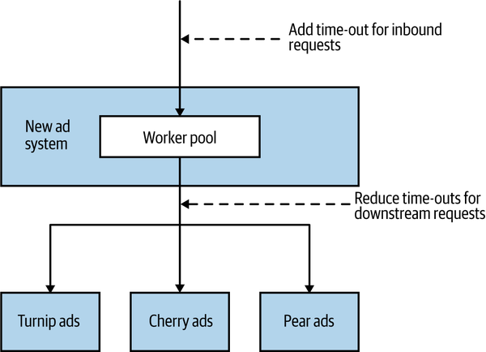

---

- Establecer time-outs en todas las llamadas a procesos externos.
- Elegir un tiempo de espera predeterminado para todas las operaciones.
- Registrar los eventos de time-out para analizar y ajustarlos según sea necesario.
- Guiarse por los tiempos de respuesta "normales" de los servicios para determinar los umbrales de time-out.

---

#### Reintento (Retry)

Muchos problemas con llamadas a servicios externos, como pérdida de paquetes o picos de carga en gateways, son temporales. En estos casos, reintentar la llamada puede ser efectivo.

Es crucial identificar qué tipos de fallos en llamadas a servicios externos justifican un reintento. Utilizando protocolos como HTTP, los códigos de respuesta pueden indicar la viabilidad de un reintento.

---

#### Circuit Breaker

Un circuit breaker es un patrón de diseño que permite a un sistema responder rápidamente a fallos en llamadas a servicios externos. Cuando se produce un fallo, el circuit breaker evita que se realicen más llamadas al servicio externo durante un período de tiempo determinado. Esto evita que el sistema se sobrecargue con llamadas fallidas.

---

<!-- _class: default -->

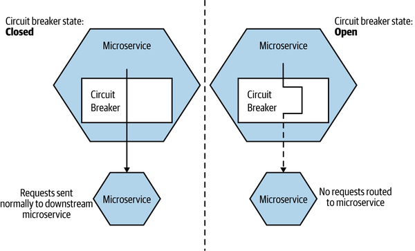

---

#### Aislamiento de fallos

La dependencia entre microservicios es un factor clave en la resiliencia del sistema. Cuanto más depende un microservicio de otro, mayor es el impacto de su indisponibilidad en la funcionalidad global. Utilizar tecnologías que permitan la operación offline de servicios downstream, como middleware o sistemas de amortiguación de llamadas, reduce el impacto de las interrupciones, ya sean planeadas o inesperadas, en los microservicios upstream.

---

#### Redundancia

La redundancia, tener múltiples instancias de un componente, es esencial para mejorar la robustez del sistema. Por ejemplo, varias instancias de un microservicio permiten manejar fallos sin perder funcionalidad. La redundancia no solo mejora la tolerancia a fallos, sino también la capacidad del sistema para manejar cargas de trabajo elevadas.

---

#### Idempotencia

Una operación idempotente es aquella que, cuando se aplica varias veces, produce el mismo resultado que si se aplicara una sola vez. Si las operaciones son idempotentes, podemos repetir la llamada varias veces sin impacto adverso. Esto es muy útil cuando queremos volver a reproducir mensajes que no estamos seguros de que se hayan procesado, una forma común de recuperarse de un error.

---

### Distribuye el riesgo

Evitar concentrar múltiples servicios-replicas en un solo nodo reduce el impacto de posibles fallas. Ser conscientes de los riesgos asociados con infraestructuras centralizadas, donde una falla podría afectar a todas las máquinas virtuales conectadas.

Distribuir servicios entre diferentes centros de datos o zonas de disponibilidad para minimizar el riesgo de interrupciones masivas.

---

### Teorema CAP

El Teorema CAP, crucial en sistemas distribuidos, establece que solo se pueden lograr dos de las siguientes tres propiedades a la vez: consistencia (C), disponibilidad (A) y tolerancia a particiones (P).

---

- Consistencia: asegura que todas las lecturas reciben la última escritura realizada.
- Disponibilidad: garantiza que cada solicitud recibe una respuesta, sin garantizar que sea la última escritura.
- Tolerancia a Particiones: capacidad del sistema para seguir operando a pesar de fallos parciales.

---

La elección entre AP y CP depende de las necesidades específicas del negocio y el contexto de uso. Algunos sistemas pueden permitir cierta desactualización (AP), mientras que otros necesitan consistencia absoluta (CP).

---

### Chaos Engineering

"Chaos Engineering" es la disciplina de experimentar con un sistema para construir confianza en la capacidad del sistema para resistir condiciones turbulentas en producción.

[Principles of Chaos Engineering](https://principlesofchaos.org/)

---

#### Enfoque Integral del Sistema

En la ingeniería del caos, el "sistema" incluye no solo los componentes de software y hardware, sino también a las personas, procesos y cultura que intervienen en la creación del producto.

---

#### Ejercicios de Día de Juego (Game Days)

Antes de formalizarse como ingeniería del caos, los ejercicios de **Día de Juego** se utilizaban para probar la preparación de equipos ante eventos realistas pero ficticios. Estos ejercicios son útiles para identificar puntos débiles en el sistema, incluyendo la dependencia de personal clave.

---

#### Experimentos en Producción

Empresas como Netflix utilizan herramientas como Chaos Monkey, que desactiva máquinas aleatoriamente en producción, para asegurar que los sistemas sean tolerantes a fallos. Estas herramientas forman parte de un "Ejército Simio" que simula diferentes tipos de fallos en la infraestructura.

---

#### De la Robustez a la Resiliencia

La ingeniería del caos, en su forma más básica, ayuda a mejorar la robustez de una aplicación, asegurando que el sistema pueda manejar problemas esperados. Sin embargo, su uso continuo para cuestionar la resiliencia del sistema puede tener un impacto mucho mayor.

---

#### Más allá de las herramientas

Implementar herramientas de ingeniería del caos no garantiza por sí mismo la resiliencia. Es crucial un enfoque integral que incluya la preparación del equipo y la adaptación continua de procesos y sistemas.

---

# Escalabilidad

---

Escalamos sistemas por dos razones: mejorar rendimiento y aumentar robustez.

Mejorar rendimiento puede incluir manejar más carga o mejorar la latencia. Aumentar la robustez mejora la resistencia y confiabilidad del sistema.

---

## Cuatro ejes

Escalabilidad vertical, horizontal, partición de datos y descomposición funcional. La elección de la combinación de técnicas de escalado depende de la naturaleza específica del problema de escalado.

---

### Escalabilidad vertical

Es aumentar la potencia de la máquina (CPU más rápido, mejor I/O).

Esto puede mejorar la latencia y el rendimiento, procesando más trabajo en menos tiempo. Esta escalabilidad es rápida de implementar, especialmente en proveedores de nube pública.

---

#### Limitaciones

- A menudo, las mejoras en hardware se traducen en más núcleos de CPU, pero no necesariamente en un mayor rendimiento de cada núcleo.
- Un servidor más grande no necesariamente mejora la robustez; sigue siendo un punto único de fallo.
- Máquinas más grandes, se vuelven más costosas, y no siempre se traduce en un aumento proporcional de recursos.

---

### Escalabilidad horizontal

Duplicar partes del sistema para manejar más carga de trabajo. Esto requiere un mecanismo para distribuir el trabajo entre estas copias.

Raramente requiere actualizaciones en la aplicación ya que la distribución de carga se maneja externamente (balanceador de carga, broker de mensajes). Es un método elegante y efectivo para distribuir la carga.

---

#### Balanceadores de Carga

Utilizados para distribuir solicitudes entre múltiples copias de un servicio. Pueden ser hardware dedicado o más comúnmente software, incluyendo balanceo en el lado del cliente.

---

<!-- _class: default -->

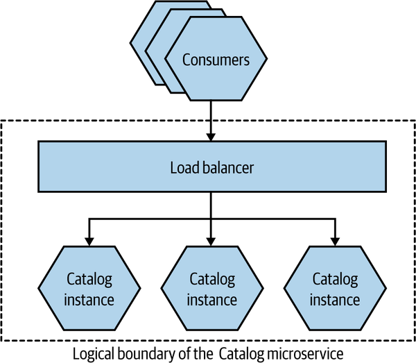

---

#### Patrón de Consumidores Competidores

Múltiples instancias consumen tareas de una cola común. Aumentar el número de instancias incrementa el rendimiento del sistema.

---

<!-- _class: default -->

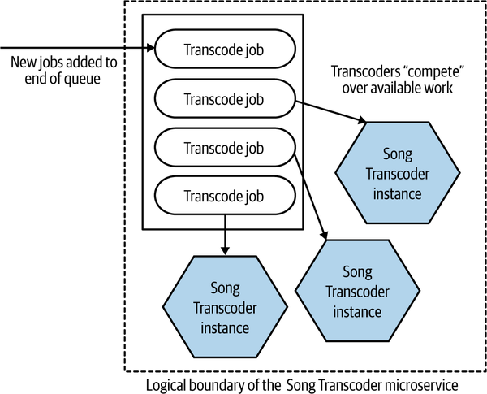

---

#### Limitaciones

- Requiere más infraestructura, lo que puede aumentar los costos.
- A veces, se ejecutan copias completas de una aplicación monolítica aunque solo una parte experimente problemas de escalabilidad.
- Implementar mecanismos de distribución de carga puede variar desde lo simple (balanceo de carga HTTP) a lo complejo (brokers de mensajes, configuración de réplicas de lectura).

---

- Algunos sistemas pueden requerir que todas las solicitudes de una misma sesión de usuario se dirijan a la misma réplica, lo que puede limitar las opciones de mecanismos de distribución y presentar otros problemas. Idealmente, se evitan sistemas que requieren balanceo de carga con sesiones "pegajosas".

---

### Partición de Datos

Consiste en distribuir la carga basándose en algún aspecto de los datos, como distribuir la carga según el usuario.

Es una estrategia de escalado más compleja que puede requerir cambios extensivos en los datos existentes y posiblemente en el código de la aplicación. Presenta desafíos en términos de robustez, distribución equitativa de carga y manejo de consultas complejas.

---

Usando una clave asociada con la carga de trabajo para dirigir las solicitudes a la base de datos correspondiente (por ej., separación por apellido en dos grupos: A-M y N-Z) o geográficamente (por país). Hay bases de datos que soportan nativamente la partición de datos.

---

<!-- _class: default -->

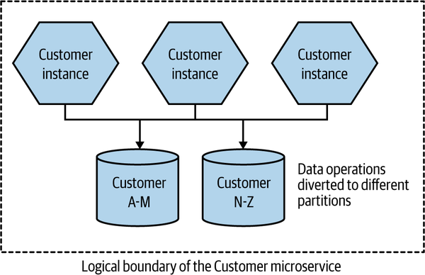

---

<!-- _class: default -->

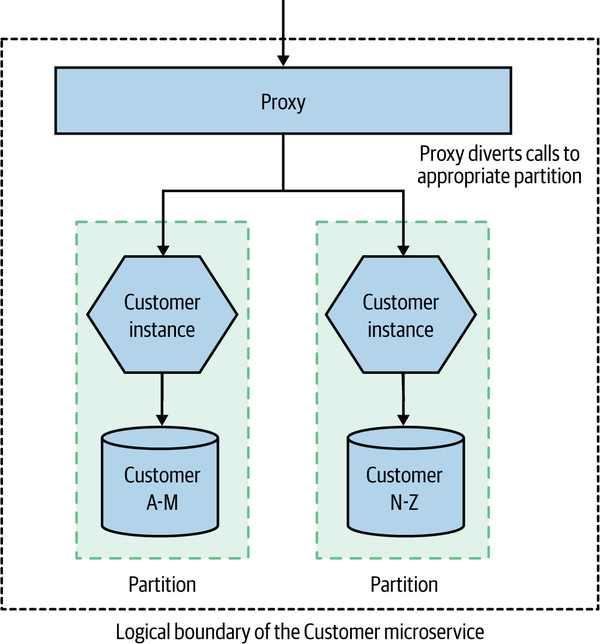

---

#### Limitaciones

- Si una partición falla, esa parte de las solicitudes fallará.
- Es crucial elegir una clave de partición adecuada para asegurar una distribución equitativa de la carga.
- Puede ser desafiante modificar el esquema de particionamiento una vez establecido.

---

- Las consultas que abarcan múltiples particiones pueden ser complejas y requerir mecanismos asincrónicos o almacenamiento de lectura alternativo.
- A menudo conduce a cambiar de tecnología de base de datos cuando se alcanzan los límites de escalabilidad.

---

### Descomposición Funcional

Consiste en extraer funcionalidades de un sistema y permitir su escalado independiente. Crear un nuevo microservicio a partir de una funcionalidad existente es la forma canónica de descomposición funcional.

Permite asignar menos recursos para funcionalidades poco utilizadas y más recursos a las más exigidas.

Abre la puerta para construir sistemas que pueden tolerar fallos parciales.

---

## Parte simple

Optimizar sistemas para problemas no existentes puede ser una pérdida de tiempo y agregar complejidad innecesaria. Antes de implementar cambios para abordar un cuello de botella, es esencial realizar experimentos para confirmar que el enfoque propuesto es efectivo. Esto puede incluir pruebas de carga automatizadas para establecer una línea base y evaluar el impacto de los cambios.

---

### CQRS

_CQRS (Command Query Responsibility Segregation)_ es un patrón que separa las responsabilidades de lectura y escritura en modelos diferentes, permitiendo escalar lecturas y escrituras de forma independiente.

En lugar de almacenar el estado actual de una entidad como un registro único, se proyecta el estado a través de una serie de eventos relacionados con esa entidad (_event sourcing_).

---

Ambos patrones pueden ser complejos y requerir un cambio significativo en el enfoque de desarrollo.

En microservicios, la decisión de usar CQRS o Event Sourcing debe ser un detalle de implementación interno y no afectar a los consumidores del microservicio.

---

## Cache

_Cache_ es almacenar resultados previos de operaciones para evitar recalcularlos, mejorando así la latencia y el rendimiento.

Un "hit" ocurre cuando los datos necesarios están en la caché; un "miss" requiere obtener la información del servicio original. Es esencial tener estrategias para invalidar el dato del cache para garantizar que los datos almacenados en caché no estén desactualizados.

---

El cache:
- Reduce la latencia al evitar llamadas de red y la carga en microservicios aguas abajo.
- Desviar lecturas a la caché puede reducir la contención en el sistema, permitiendo una mejor escalabilidad.
- Un caché local completo puede permitir la operación incluso si el servicio original está inactivo, aunque esto puede implicar trabajar con datos potencialmente obsoletos.

---

### Cache del lado del cliente

Los datos se almacenan fuera del origen, como en un _hashtable_ en memoria en el proceso de ejecución.

Eficaz para mejorar la latencia y la robustez, evita llamadas de red al microservicio aguas abajo. Limitaciones en mecanismos de invalidación y posible inconsistencia entre clientes.

---

<!-- _class: default -->

---

<!-- _class: default -->

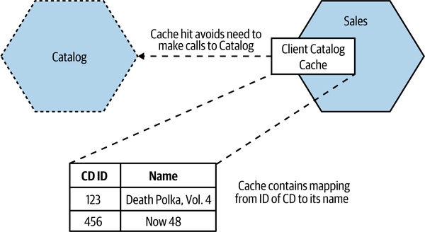

---

### Cache del lado del servidor

El microservicio mantiene su propio cache.

Permite implementar mecanismos de invalidación más sofisticados y evita inconsistencias entre consumidores. Menos efectivo para mejorar la latencia y la robustez ya que aún requiere una llamada al microservicio.

---

<!-- _class: default -->

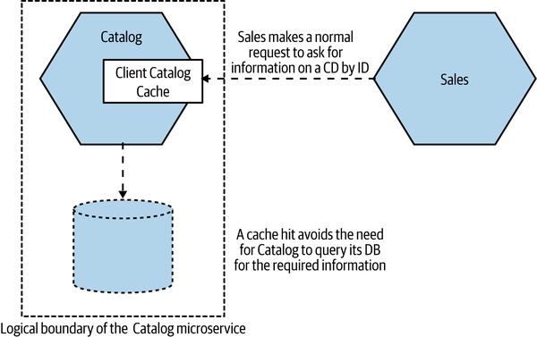

---

### Cache de Solicitud

Almacena la respuesta a una solicitud específica. Muy eficiente, elimina la necesidad de nuevas consultas a los datos. Pero altamente específico; otras operaciones menos recurrentes no se benefician de este cache.

---

<!-- _class: default -->

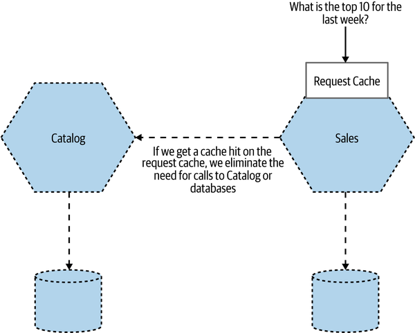

---

### Invalidación de cache

#### Tiempo de Vida (TTL)

Cada entrada en la cache se considera válida por un período específico. Se puede especificar una duración de validez, pero puede llevar a trabajar con datos desactualizados si la información en el origen cambia antes de que el TTL expire.

---

#### GET Condicional

Uso de ETags permite verificar si el valor de un recurso ha cambiado antes de realizar una nueva solicitud GET. Evita regenerar recursos innecesariamente, útil si la generación de la respuesta es costosa.

---

#### Invalidación basada en notificaciones

Se utilizan eventos para informar a los suscriptores sobre la necesidad de invalidar entradas en su caché local. Reduce el tiempo en que la cache podría estar sirviendo datos obsoletos. Complejidad de implementación y necesidad de un mecanismo de notificación efectivo.

---

### La Regla de Oro del Cache

Cuantos más caches existan entre la fuente de datos frescos y el cliente, más desactualizados pueden estar los datos. Múltiples capas de caché complican el entendimiento de cuán actualizados están los datos que ve el cliente.

El cache incrementa la complejidad del sistema. El número ideal de lugares para implementar caché es cero; cualquier otro es una optimización que debe ser justificada.

---

### Equilibrio entre Frescura y Optimización

Reducir el TTL puede disminuir la ventana de datos desactualizados, pero aumenta la cantidad de llamadas al origen, afectando la latencia y la carga. Es esencial comprender los requerimientos del usuario final y del sistema en general. Los usuarios prefieren datos frescos, pero no a costa de la estabilidad del sistema.

---

### Cache Poisoning

Un error en la inserción de encabezados de cache puede conducir a no actualizar permanentemente los datos. En aplicaciones web públicas, múltiples caches (CDNs, ISPs, navegadores de usuarios) pueden complicar la gestión de la frescura de los datos.

---

## Autoescalado

Capacidad de escalar automáticamente los microservicios en función de la carga o de la disponibilidad. Necesita una provisión de hosts virtuales completamente automatizable y despliegue automático de instancias de microservicios.

---

### Estrategias de autoescalado

- **Predictivo:** Basado en tendencias conocidas, como picos de carga en horarios específicos. Por ejemplo, escalar hacia arriba antes del inicio de un pico de demanda y reducir la escala después.
- **Reactivo:** Escalar en respuesta a cambios en la carga o fallos de instancias, ajustando la capacidad según sea necesario.

---

### Pruebas de carga

Fundamentales para probar las reglas de autoescalado y asegurarse de que funcionen según lo previsto. Evitar descubrir errores en las reglas de autoescalado solo en producción.

---

## 📚 Material complementario
- Building microservices: Designing fine-grained systems, Sam Newman (2021). O'Reilly. Capitulo 11, 12 y 13.
- Threat Modeling: Designing for Security, Adam Shostack (2014). Wiley.
- [Principles of Chaos Engineering](https://principlesofchaos.org/)